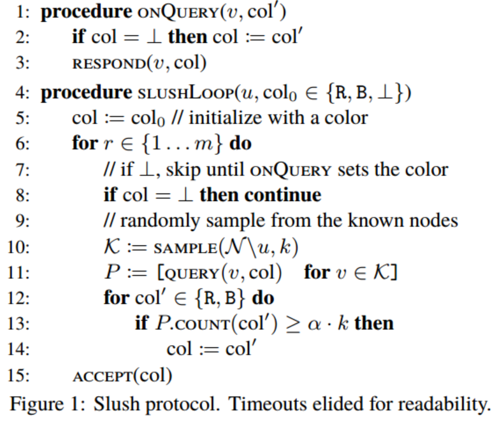
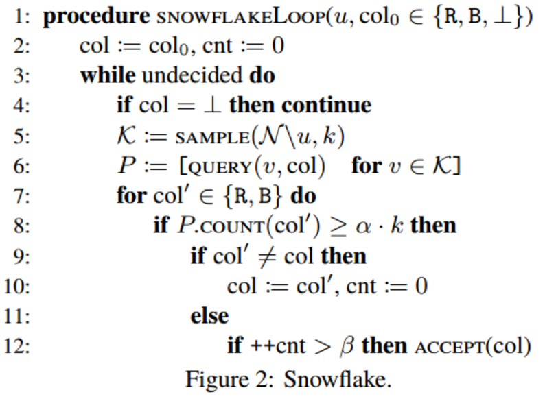
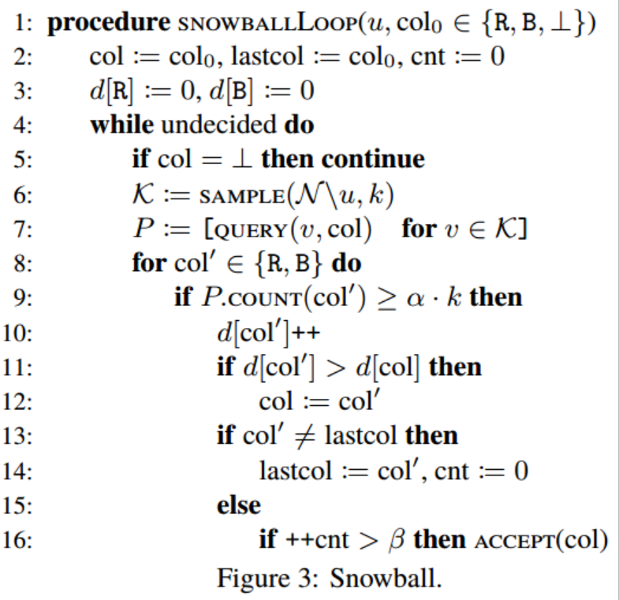

# 
Avalanche共识协议 - 学习笔记1

## 解决什么问题
#### 共识协议及其缺陷
共识协议有古典共识协议，PoW，PoS等。
- 古典共识协议：网络通信量大 
- PoW：成本高，资源消耗型算法 
- PoS： 非公平算法，共识结果主要取决于节点资本的多寡

## 方案
协议族包含四个协议：slush，snowflake，snowball，avalanche。

#### 四个协议之间的关系
- Slush协议是基础协议，反应了协议族的基本工作原理
- snowflake/snowball协议基于slush协议进行了改进，增强了系统的安全性/活性
- avalanche协议是最终协议，也是协议族中的核心协议，综合了前三种协议的优点长处。

#### Slush协议

###### 协议原理
- 所有节点最初是 uncolored 状态
- 当节点收到一个 client 发来的交易请求之后，它就立刻把自己变成 tx 中设置的 color，同时发起一笔 query。
	- 执行 query 时，节点会随机选择一个相对小的节点样本 k，向他们发出 query。
	- 如果是 uncolored 的节点收到 query，那么就染色，并回复 color。同时还会发起一个 query（也就是 Gossip）。
	- 如果是已经 colored 的节点收到 query，那么就回复自己已染的 color。
	- 如果没有在限定时间内收到 k  个响应，那么节点就会从（之前 sample 后）剩余节点中继续选择一些节点发出 query。直到收集到所有 k  个 响应。
	- 一旦收集到 k 个响应，就判断是否能存在一个同颜色/总颜色的比率 fraction ≥ αk，α > 0.5，它是一个协议参数（protocol parameter）。 如果 αk 阈值（threshold）满足，并且sampled color 跟节点自身的 color 不一样，那么节点就会把自己的 color 变成 sampled color。然后，继续回到 query 步骤，发起新一轮的 query，总共发起 m 轮。最终，节点会在 m 时间期限内决定最终的 color。

###### 协议特点
- Gossip协议同步数据
- 随机扰乱，生成数据偏差
- 反复抽样，放大数据偏差

#### Snowflake协议

###### 协议原理
- 在查询节点增加了一个counter，用以记录某颜色col持续查询成功的轮次数
- 设置初始颜色为col并查询，若查询节点本次查询的k个被查询节点中，有超过α\*k个被查询节点回应，且：回应颜色等于col，则counter++；若回应颜色不等于col，则counter清零
- 当counter值超过阈值β时，表明该颜色col是被接受的，查询成功

###### 协议特点
通过设置持续查询成功计数器和阈值β，改变了Slush协议中只判断第m轮结果颜色的不合理方式，增加了系统的Safety

#### Snowball 协议
###### 协议原理
- 系统增加了一个置信度计数器，用来记录各颜色查询成功的次数
- 系统当前颜色为置信度高的颜色

###### 协议特点
- 通过改变判断当前颜色的机制，将某次查询触发当前颜色改变，改为全局置信度触发，增强了系统的Safety。（Snowflake协议中，当此次查询成功的颜色与上次不同时，即改变当前颜色；Snowball协议中，选择置信度高的颜色为当前颜色。）

未完待续......
