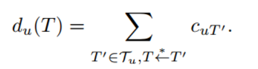
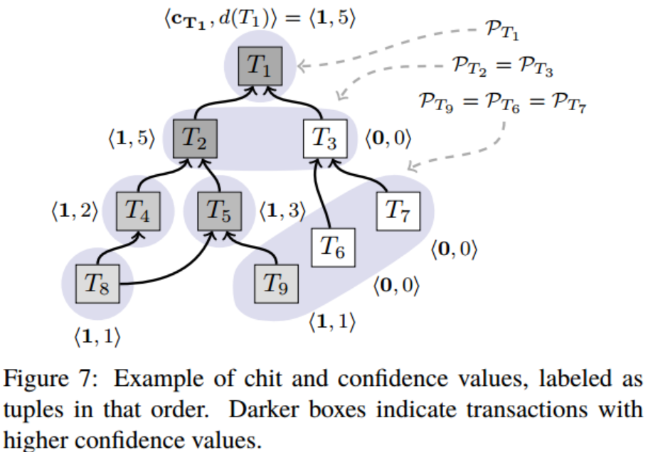
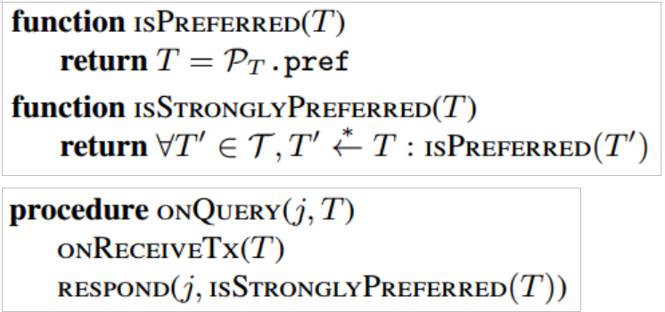
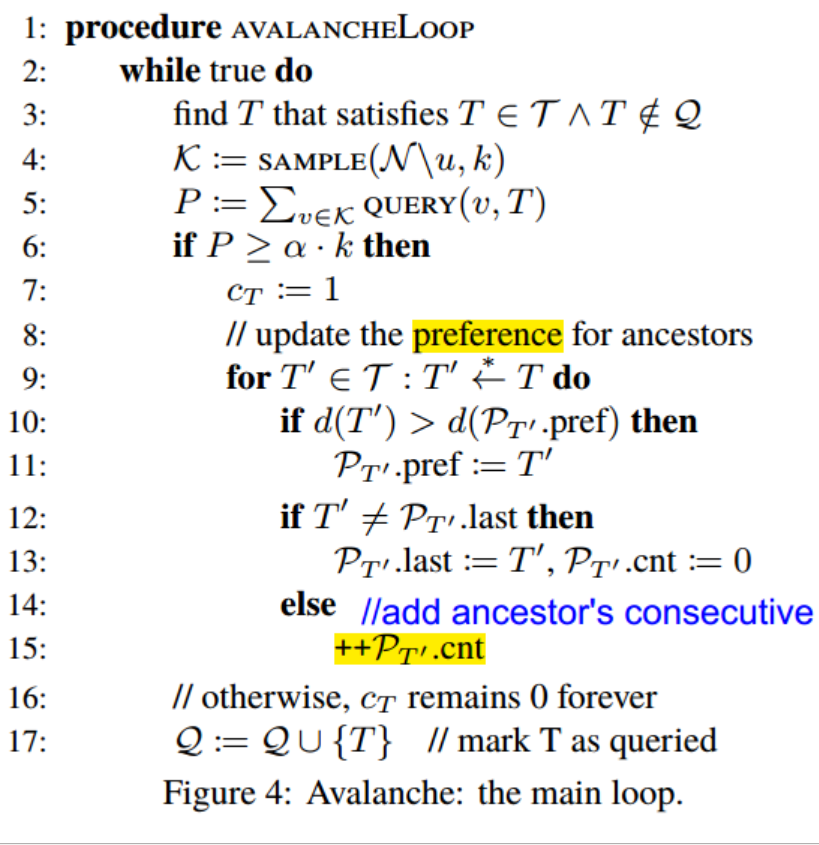
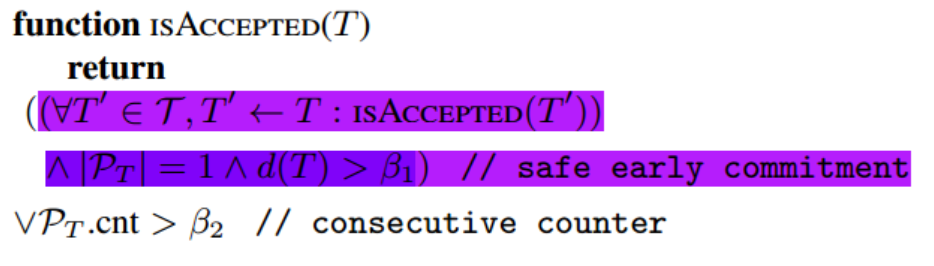
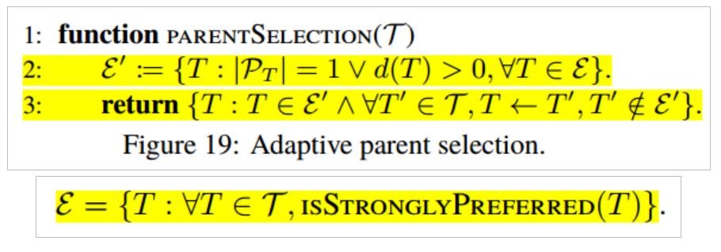

# 
Avalanche共识协议 - 学习笔记2

本文接上一篇学习笔记[Avalanche共识协议 - 学习笔记1](https://github.com/smallfat/smallfat.github.io/edit/master/Avalanche%E7%99%BD%E7%9A%AE%E4%B9%A6%E5%AD%A6%E4%B9%A0%E7%AC%94%E8%AE%B0.md)，继续记录我学习Avalanche协议的成果。

## 方案
#### Avalanche协议
###### 协议原理
- 抽象出DAG结构，这是由交易组成的有向无环图
- 增加了冲突集的概念。冲突集表示集合内的交易是互相冲突的，即存在双花问题。不存在双花问题的交易节点，其冲突集内只有该节点。
- 用二元组表示节点u的(chit, confidence)，chit表示一轮抽样中交易T在节点u上收到Yes返回值，confidence表示交易T的置信度，confidence的值等于其所有子孙节点的chit值之和

- DAG结构如图

- 节点u随机选择k个被查询节点，查询对象是待查询交易T以及DAG中T->T'路径上的每个交易。当被查询节点对所有交易都满意，即每个交易在该节点上是交易冲突集中的preferred时，该节点返回Yes;否则返回No。

- 节点u收集到αk个Yes回复后，设置Cu(T)=1，并更新T->T'路径中的所有节点的d(T')值和冲突集中的preferred值。

- 交易T被接受的条件是：
	- 第一种方式，需满足三个条件：T->T'路径上的所有交易都是可被接受的；T的冲突集中只有T； 交易置信度d(T)>β1；
	- 第二种方式：冲突集ρ(T)内，交易T的持续查询成功计数器ρ(T).cnt>β2；

第一种方式针对普通诚实交易，条件1将当前交易T与祖先交易集捆绑，只有当祖先交易集的所有交易都可被接受，T才可以被接受，增强了系统的安全性；条件2要求这是一个普通诚实交易，不与其他交易存在冲突；条件3要求交易的置信度达到阈值β1；这种方式也被称为“早期安全提交(safe early commitment)”。
当一个诚实交易因为祖先集的liveness原因不能被接受，可以为该交易重新选择父节点。
第二种方式包含了所有交易，只要交易T被持续成功查询次数达到阈值β2，即可接受。对于一个非诚实交易来说，随机取样与连续取值决定了其被接受的概率非常的低。

- DAG中，新交易T选择父节点的策略
	- 目的：构筑一个良好DAG结构，最终使得诚实交易会被快速接受
	- 原则：1）维护一个良好的DAG形态，保持稳定的宽度，提供足够的并发性；2）不能影响系统的安全性
	- 思路：计算有效候选集，从中随机选出父节点。
	- 方法：从DAG前沿顶点（不含）到创世顶点（不含），沿着IsStronglyPrefered(T)算法一路寻找，不考虑d(T)=0的顶点或冲突集中交易数>1的顶点，找到父顶点候选集，然后随机从中选取父节点。

###### 协议特点
- 核心最终协议
- 以极高的概率保证：诚实的交易最终会被正常节点接受，不诚实的交易（冲突交易）不会被接受
- 绿色环保，不消耗能源
- 并行共识模型 - 传统RSM模型是每个客户端运行RSM模型并保持全序交易队列，本算法中每个客户端独立地与自己的RSM交互，并在依赖交易中建立偏序关系

#### 安全性分析
###### 双花攻击与防范
- 双花攻击的原理：交易的一个输出被作为另一个交易的输入两次或两次以上
- 防范措施：将构成双花的交易组成一个冲突集，对冲突集内的交易，通过抽样选举，选择出一个置信度高或持续选举成功的交易予以接受。

###### Sybil攻击与防范
- Sybil攻击的原理：恶意节点伪造多重合法身份，利用这些身份对信息进行截取，篡改，传播，从而达到逆反共识的目的。
- 防范措施：通过投注AVA代币股份来防止sybil攻击。这意味着节点需要拥有AVA代币，以表明他们在系统中拥有一些所有权。所以这里的投入股份只是为了确保你不能冒充别人。与以太坊和其他代币不同，这些股份不是抵押品，而是永远不会丢失的。如果你行为不端，你的钱也不会被扣走。股份投注不是用于达成共识，而事实上它完全独立共识。
