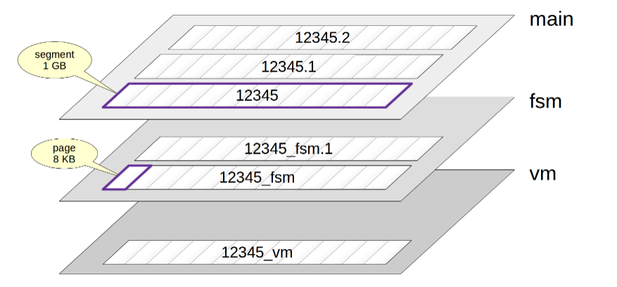
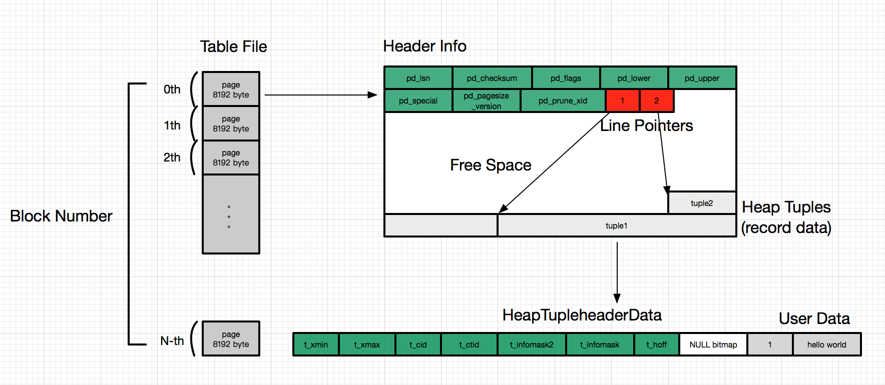
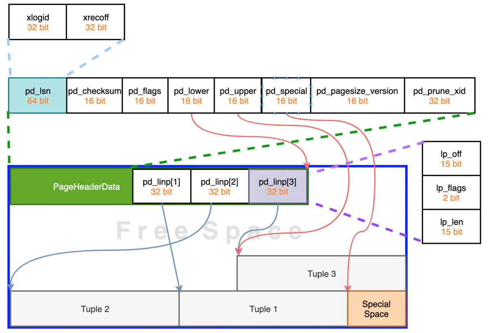
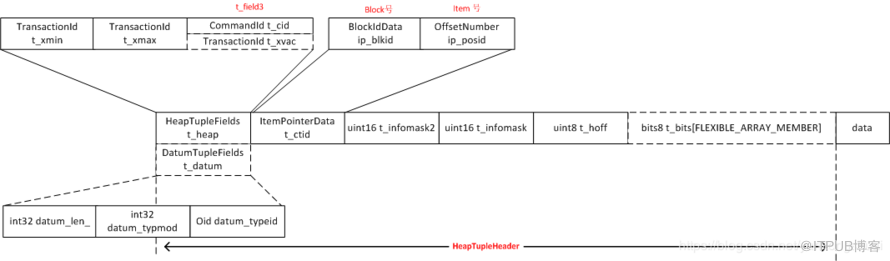

# Storage



### Relations
- table
- sequence
- materialized view
- index


### Folks
- main
- fsm
- vm

### Files
- 在磁盘上的数据文件路径
	- 目录：$tablespace_name/$database_oid
	- 文件
		- $relation_oid/$relation_oid.1......
		- $relation_oid.fsm/$relation_oid.fsm.1......
		- $relation_oid.vm

### Pages
- 每个数据文件，内部由pages组成。如图“图：数据文件格局”
# Page
### Page Layout



### Page Header


- pd_lsn - 当前page内最新的数据所对应的xlog lsn
- pd_checksum
- pd_flags 
 ```
 /*
  * pd_flags contains the following flag bits.  Undefined bits are initialized
  * to zero and may be used in the future.
  *
  * PD_HAS_FREE_LINES is set if there are any LP_UNUSED line pointers before
  * pd_lower.  This should be considered a hint rather than the truth, since
  * changes to it are not WAL-logged.
  *
  * PD_PAGE_FULL is set if an UPDATE doesn't find enough free space in the
  * page for its new tuple version; this suggests that a prune is needed.
  * Again, this is just a hint.
  */
```
- pd_lower - 指向空闲区起始位置
- pd_upper - 指向空闲区结束位置
- pd_special - 指向special space起始位置
- pd_pagesize_version
- pd_prune_xid


### Line pointer
lp_off: tuple距离page头的位移
lp_flags
- lp_unused
- lp_normal
- lp_redirect
- lp_dead
lp_len: tuple长度


### Tuple Header


### Tuple Data

# MVCC
