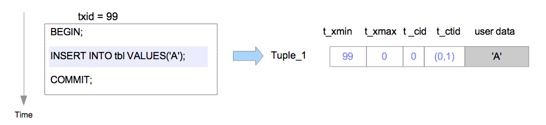

# Storage


### Relations
- table
- sequence
- materialized view
- index


### Folks
- main
- fsm
- vm

### Files
- 在磁盘上的数据文件路径
	- 目录：$tablespace_name/$database_oid
	- 文件
		- $relation_oid/$relation_oid.1......
		- $relation_oid.fsm/$relation_oid.fsm.1......
		- $relation_oid.vm

### Pages
- 每个数据文件，内部由pages组成。如图“图：数据文件格局”
# Page
### Page Layout


### Page Header


- pd_lsn - 当前page内最新的数据所对应的xlog lsn
- pd_checksum
- pd_flags 
	- PD_HAS_FREE_LINES - is set if there are any LP_UNUSED line pointers before pd_lower
	- PD_PAGE_FULL - is set if an UPDATE doesn't find enough free space in the page for its new tuple version; 
- pd_lower - 指向空闲区起始位置
- pd_upper - 指向空闲区结束位置
- pd_special - 指向special space起始位置
- pd_pagesize_version
- pd_prune_xid

### Line pointer
- lp_off: tuple距离page头的位移
- lp_flags
	- lp_unused
	- lp_normal
	- lp_redirect
	- lp_dead
- lp_len: tuple长度


# Tuple
- 每个tuple，可以对应table内的一行数据

### Tuple Header


- HeapTupleFields与DatumTupleFields的关系
	- union结构
	- tuple在内存中创建的时候，这时候还没有涉及到transaction以及visibility，因此使用t_datum : DatumTupleFields记录datum的一些属性。
	- 在某个事务把tuple插入page buffer或者表文件的时候，这时候需要记录transaction id以及visibility，因此将t_datum替换为t_heap : HeapTupleFields
	
- header字段的对齐	


### tuple的增删改

元组(tuple)与page的关系如下图所示(详细字段见上文所述)：


以下关于tuple增删改的描述，是假定最多两个事务同时并发操作一行数据(一个tuple)，但操作依然存在先后关系(这个由其他机制保证)。

##### 插入

在插入操作中，新元组将直接插入到目标表的页面中，如下图所示：



假设元组是由txid=99的事务插入页面中的，在这种情况下，被插入元组的首部字段会依以下步骤设置。
Tuple_1：
 - t_xmin设置为99，因为此元组由txid=99的事务所插入。
 - t_xmax设置为0，因为此元组尚未被删除或更新。
 - t_cid设置为0，因为此元组是由txid=99的事务所执行的第一条命令所插入的。
 - t_ctid设置为(0,1)，指向自身，因为这是该元组的最新版本。

##### 删除

在删除操作中，目标元组只是在逻辑上被标记为删除。目标元组的t_xmax字段将被设置为执行DELETE命令事务的txid。如下图所示：


在这种情况下，Tuple_1的首部字段会依以下步骤设置。

Tuple_1：
- t_xmax被设为111。

如果txid=111的事务已经提交，那么Tuple_1就不是必需的了。通常不需要的元组在PostgreSQL中被称为死元组（dead tuple）。

死元组最终将从页面中被移除。清除死元组的过程被称为清理（VACUUM）过程

##### 更新

在更新操作中，PostgreSQL在逻辑上实际执行的是删除最新的元组，并插入一条新的元组


假设由txid=99的事务插入的行，被txid=100的事务更新两次。

当执行第一条UPDATE命令时，Tuple_1的t_xmax被设为txid 100，在逻辑上被删除；然后Tuple_2被插入；接下来重写Tuple_1的t_ctid以指向Tuple_2。Tuple_1和Tuple_2的头部字段设置如下。

Tuple_1：
- t_xmax被设置为100。
- t_ctid从(0,1)被改写为(0,2)。

Tuple_2：
 - t_xmin被设置为100。
 - t_xmax被设置为0。
 - t_cid被设置为0。
 - t_ctid被设置为(0,2)。

当执行第二条UPDATE命令时，和第一条UPDATE命令类似，Tuple_2被逻辑删除，Tuple_3被插入。Tuple_2和Tuple_3的首部字段设置如下:

Tuple_2：
 - t_xmax被设置为100。
 - t_ctid从(0,2)被改写为(0,3)。

Tuple_3：
 - t_xmin被设置为100。
 - t_xmax被设置为0。
 - t_cid被设置为1。
 - t_ctid被设置为(0,3)。

与删除操作类似，如果txid=100的事务已经提交，那么Tuple_1和Tuple_2就成为了死元组，而如果txid=100的事务中止，Tuple_2和Tuple_3就成了死元组。

# 事务与tuple构成的可见性系统
- HeapTupleFields与clog构成可见性系统
	- t_ctid(ItemPointerData类型) -  composed by {ip_blkid, ip_posid}, ip_blkid tells us which block, ip_posid tells us which entry in  the linp (ItemIdData) array we want. 此处,block指table中的一个page; ip_posid指的是linp数组中的索引
	- update 操作 - 相当于delete操作+insert操作
	- 多版本tuple - t_ctid总是指向下一个有效的tuple物理位置，即{page index, linp index}
	- t_xmin与t_xmax - 当前tuple中的insert操作者transaction id与delete 操作者transaction id
	- t_cid与visibility关系不大


- Visibility Check Rules
```
Rule 1: If Status(t_xmin) = ABORTED ⇒ Invisible
Rule 2: If Status(t_xmin) = IN_PROGRESS ∧ t_xmin = current_txid ∧ t_xmax = INVAILD ⇒ Visible
Rule 3: If Status(t_xmin) = IN_PROGRESS ∧ t_xmin = current_txid ∧ t_xmax ≠ INVAILD ⇒ Invisible
Rule 4: If Status(t_xmin) = IN_PROGRESS ∧ t_xmin ≠ current_txid ⇒ Invisible
Rule 5: If Status(t_xmin) = COMMITTED ∧ Snapshot(t_xmin) = active ⇒ Invisible
Rule 6: If Status(t_xmin) = COMMITTED ∧ (t_xmax = INVALID ∨ Status(t_xmax) = ABORTED) ⇒ Visible
Rule 7: If Status(t_xmin) = COMMITTED ∧ Status(t_xmax) = IN_PROGRESS ∧ t_xmax = current_txid ⇒ Invisible
Rule 8: If Status(t_xmin) = COMMITTED ∧ Status(t_xmax) = IN_PROGRESS ∧ t_xmax ≠ current_txid ⇒ Visible
Rule 9: If Status(t_xmin) = COMMITTED ∧ Status(t_xmax) = COMMITTED ∧ Snapshot(t_xmax) = active ⇒ Visible
Rule 10: If Status(t_xmin) = COMMITTED ∧ Status(t_xmax) = COMMITTED ∧ Snapshot(t_xmax) ≠ active ⇒ Invisible
```

- Questions
	- 上述check rules，基本以current tid与t_xmin/t_xmax的关系作为rule，没有涉及事务的isolation级别。根据isolation的理论，visibility与isolation级别应该是强相关的。？？？？？

# Tuple Data
### tuple data存储位置
- tuple data的存储位置: t_hoff表示了data起始处相对于TupleDataHeader起始处的offset

### TupleDesc
- 如下图，tupledesc描述了table中每个字段的属性


### tuple data在HeapTupleHeaderData后的组织
- 见heap_fill_tuple

### 插入tuple
##### 基本逻辑
- heap_fill_tuple
- 在pd_lower后添加pd_linp记录，在pd_upper前新增tuple记录

##### 并发处理
- 几个问题
	- 同时对同一个table的同一行数据的update，怎么处理
	- 同时对同一个table的insert，怎么处理
	- 同时对同一个table的delete，怎么处理	
	- mvcc对读写或写读有好处，对写写怎么样？
	
- 这里的并发，不仅仅包括事务级别的并发，还包括engineering thread角度的并发，因此有两个维度
- 留待研究lock这个主题时，再来深入分析
- lock与mvcc并发并不冲突，是互相补充的关系
- 写case，看日志，结合原理，分析代码