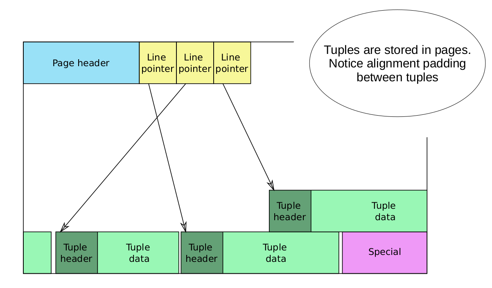

# Storage


### Relations
- table
- sequence
- materialized view
- index


### Folks
- main
- fsm
- vm

### Files
- 在磁盘上的数据文件路径
	- 目录：$tablespace_name/$database_oid
	- 文件
		- $relation_oid/$relation_oid.1......
		- $relation_oid.fsm/$relation_oid.fsm.1......
		- $relation_oid.vm

### Pages
- 每个数据文件，内部由pages组成。如图“图：数据文件格局”
# Page
### Page Layout




### Page Header


- pd_lsn - 当前page内最新的数据所对应的xlog lsn
- pd_checksum
- pd_flags 
	- PD_HAS_FREE_LINES - is set if there are any LP_UNUSED line pointers before pd_lower
	- PD_PAGE_FULL - is set if an UPDATE doesn't find enough free space in the page for its new tuple version; 
- pd_lower - 指向空闲区起始位置
- pd_upper - 指向空闲区结束位置
- pd_special - 指向special space起始位置
- pd_pagesize_version
- pd_prune_xid

### Line pointer
- lp_off: tuple距离page头的位移
- lp_flags
	- lp_unused
	- lp_normal
	- lp_redirect
	- lp_dead
- lp_len: tuple长度


### Tuple
- 每个tuple，可以对应table内的一行数据

### Tuple Header


- HeapTupleFields与DatumTupleFields的关系
	- union结构
	- tuple在内存中创建的时候，这时候还没有涉及到transaction以及visibility，因此使用t_datum : DatumTupleFields记录datum的一些属性。
	- 在某个事务把tuple插入page buffer或者表文件的时候，这时候需要记录transaction id以及visibility，因此将t_datum替换为t_heap : HeapTupleFields

- HeapTupleFields与clog构成可见性系统
	- t_ctid : ItemPointerData -  composed by {ip_blkid, ip_posid}, ip_blkid tells us which block, ip_posid tells us which entry in  the linp (ItemIdData) array we want. 此处,block指table中的一个page; ip_posid指的是linp数组中的索引
	- update 操作 - 相当于delete操作+insert操作
	- 多版本tuple - t_ctid总是指向下一个有效的tuple物理位置，即{page index, linp index}
	- t_xmin与t_xmax - 当前tuple中的insert操作者transaction id与delete 操作者transaction id
	- t_cid与visibility关系不大

- Visibility Check Rules
```
Rule 1: If Status(t_xmin) = ABORTED ⇒ Invisible
Rule 2: If Status(t_xmin) = IN_PROGRESS ∧ t_xmin = current_txid ∧ t_xmax = INVAILD ⇒ Visible
Rule 3: If Status(t_xmin) = IN_PROGRESS ∧ t_xmin = current_txid ∧ t_xmax ≠ INVAILD ⇒ Invisible
Rule 4: If Status(t_xmin) = IN_PROGRESS ∧ t_xmin ≠ current_txid ⇒ Invisible
Rule 5: If Status(t_xmin) = COMMITTED ∧ Snapshot(t_xmin) = active ⇒ Invisible
Rule 6: If Status(t_xmin) = COMMITTED ∧ (t_xmax = INVALID ∨ Status(t_xmax) = ABORTED) ⇒ Visible
Rule 7: If Status(t_xmin) = COMMITTED ∧ Status(t_xmax) = IN_PROGRESS ∧ t_xmax = current_txid ⇒ Invisible
Rule 8: If Status(t_xmin) = COMMITTED ∧ Status(t_xmax) = IN_PROGRESS ∧ t_xmax ≠ current_txid ⇒ Visible
Rule 9: If Status(t_xmin) = COMMITTED ∧ Status(t_xmax) = COMMITTED ∧ Snapshot(t_xmax) = active ⇒ Visible
Rule 10: If Status(t_xmin) = COMMITTED ∧ Status(t_xmax) = COMMITTED ∧ Snapshot(t_xmax) ≠ active ⇒ Invisible
```

- Questions
	- 上述check rules，基本以current tid与t_xmin/t_xmax的关系作为rule，没有涉及事务的isolation级别。根据isolation的理论，visibility与isolation级别应该是强相关的。？？？？？
	
- header字段的对齐	


### Tuple Data
- tuple data的存储位置: t_hoff表示了data起始处相对于TupleDataHeader起始处的offset
- 


### 插入tuple
- write new tuple 
	- 在pd_lower后添加pd_linp记录，在pd_upper前新增tuple记录
	- 并发新增tuple - 

### 读取tuple


# MVCC
