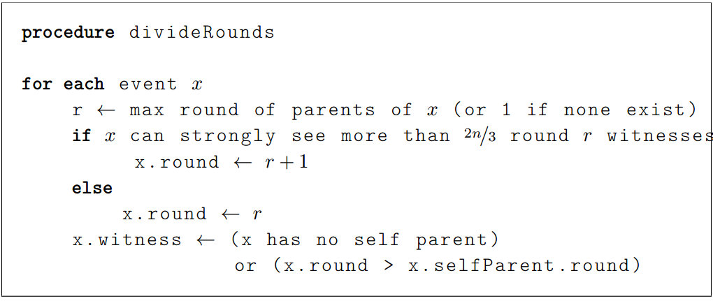
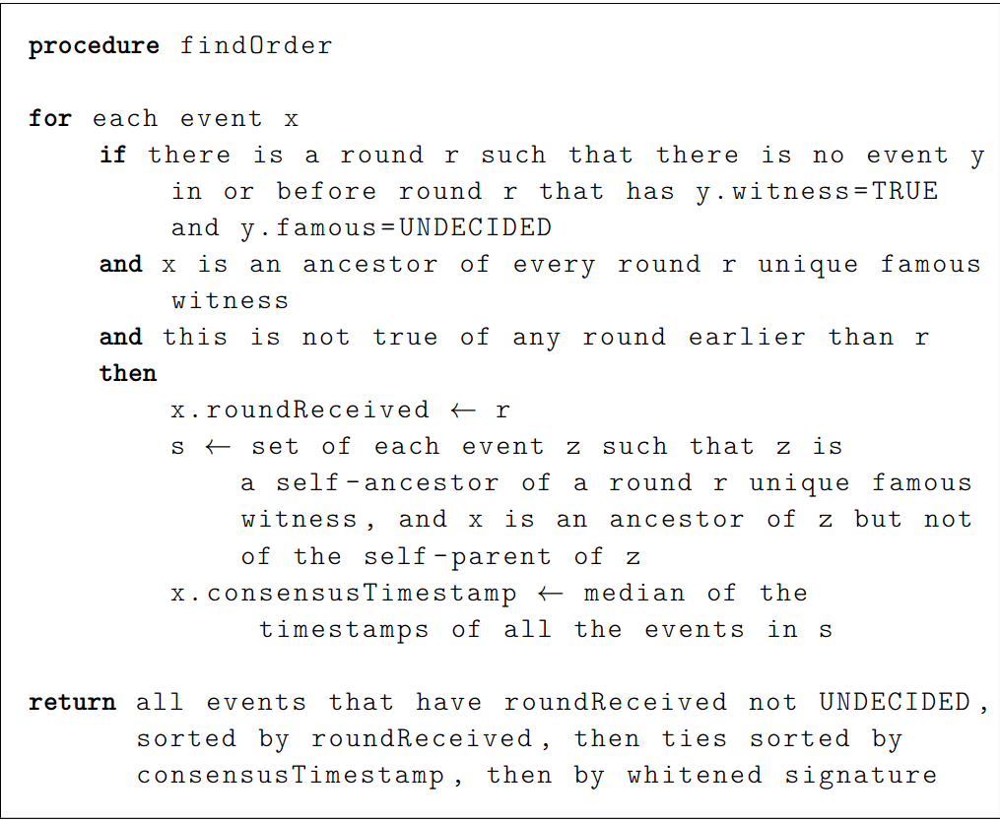

# 
hashgraph共识协议读书笔记

## 目标
- 提出一个fast,fair,secure的共识协议
- ABFT：在有条件的异步网络中，能够做到Byzantine Fault Tolarance.
- 最终构造出一个**全序**的transaction序列
- 给出了两项保证(guarantees)
    - If any successful call submit_transaction(T1) is made for some transaction T1, then there is some value of index for which all calls to get_transaction(index) will eventually return T1
    - If any call to get_transaction(index) returns transaction T2(not null), then every call to get_transaction(index) returns either null or T2, and all eventually return T2 (not null)

## 限制条件
- 有1/3的节点可以是不诚实节点，他们可以是攻击者，可以互相串通，他们能删除或延迟诚实节点之间的消息，能控制网络去延迟或删除任何消息
- 两个诚实节点之间发送的消息，最终会被收到
- 假设数字签名安全，攻击者不能更改消息
- 哈希函数是安全的，永远不会发生碰撞
- 当前应用在私链和联盟链中，故可保证节点的可信度，可暂时不考虑sybil攻击的情况

## 基本概念
- event - 实质上是block 区块。包含指向本节点最新event的hash指针和指向gossip来源event的hash指针，是"gossip about gossip"的设计实现。Hashgraph上的每一个顶点(circle)代表一个block。The Block is signed by creator to prevent tampering. The block contains a payload of anytransactions that creator chooses to create（在block创建时，block创建者能够随意加入她想加入的任何交易。）
- hashgraph - 一种数据结构，记录了以什么顺序，谁gossip了谁
- Gossip about gossip - hashgraph在gossip协议的基础上进行传播扩散。Alice会在gossip传播的时候告诉Bob**所有她知道的信息**，包括txs，2 hash， created time， set of ansestor 's hash等等，这样循环往复，最终每个node上都有全节点的传播路径即hashgraph了
- 可见 seeing - 区块x可见区块y意味着y是x的祖先区块
- 强可见 strongly seeing - 区块x强可见区块y意味着y是x的祖先区块且x到y的所有路径跨过了2/3以上的节点
- 轮次 round - 分为创建轮(created round)和接受轮(received round)
- 创建轮(created round) - 假设一个区块的创建轮次是R或者R+1，其中R是该区块父节点的最大轮次。当且仅当区块能**强可见****绝对多数**的R轮见证人，则该区块的创建轮次为R+1
- 接受轮(received round) - 第r轮（创建轮次）中所有的**知名见证者可见**的任何**普通区块**都会被赋予第r轮的接受轮次
- 见证人 witness - 每个节点在每个轮次中创建的第一个事件就是见证人事件，即该轮次的祖先事件，节点可能在某个轮次中没有见证人事件
- 知名见证人 famous witness - 如果第r轮的见证人区块能被**绝对多数的第r+1轮的见证人可见**，那么他就是知名见证人
- 一致(consistent) - consistent means if there is event x in both hashgraph A and B, then the same parents of x both exists in A and B
- 同步网络 - 是指系统中的各个节点的时钟误差存在上限；并且消息传递必须在一定时间内完成，否则认为失败；同时各个节点完成处理消息的时间是一定的。因此同步系统中可以很容易地判断消息是否丢失。
- 异步网络 - 意味着系统中各个节点可能存在较大的时钟差异；同时消息传输时间是任意长的；各节点对消息进行处理的时间也可能是任意长的。这就造成无法判断某个消息迟迟没有被响应是哪里出了问题（节点故障还是传输故障？）。不幸地是，现实生活中的系统往往都是异步系统。
- FLP原理 - 在网络可靠，但允许节点失效（即便只有一个）的最小化异步模型系统中，**不存在**一个可以解决一致性问题的确定性共识算法（No completely asynchronous consensus protocol can tolerate even a single unannounced process death）。

## 算法

 - 总体
 

    
     - 每个成员随机选择目标成员，并向目标成员发送同步数据。
     - 在发送同步数据的同时，每个成员也接受同步数据。
     - Alice发送给Bob的数据，是Alice知道而Bob不知道的。
     - Bob只接受拥有合法签名blocks，然后将这些数据（主要是blocks），加入到hashgraph中
     - 将所有已知的blocks划分轮次
     
 - 划分轮次

 - 确定witness和famous witness

 - 确定交易次序

## 定理与证明
 - cornerstone of Byzantine Fault Tolerance 1 - 如果x和y是一个不合法fork的两个不同分支，则w最多只能强可见x和y中的一个。
 - cornerstone of Byzantine Fault Tolerance 2 - 如果hashgraph A和B是一致的(consistent)，则以下是不可能的：在A中x能被一个block强可见，在B中y也能被另外的block强可见
- 所有的成员节点有consistent hashgraph
- 强可见定理 - if the pair of events(x,y) is a fork, and x is strongly seen by event z in hashgraph A, then y will not be strongly seen by any event in any hashgraph B that is consistent with A.
- theorem 5.19 - (Byzantine Fault Tolerance Theorem). Each event x created by an
honest member will eventually be assigned a consensus position in the total order
of events, with probability 1.
  - 根据限制条件，无论网络状况如何，某event x最终会被gossip到全网所有honest节点，所有honest节点都会收到event x。
  - 最终，肯定存在某个round r，所有的见证人都是event x的后代(**因为在round-i轮，event x已经到达了各个menber，round r的见证人通过各menber的self ansester 路径，能够see event x**)，因此该轮所有的知名见证人也是event x的后代。
  - 此时，event x确立了接受轮次和共识时间，它的位置就固定了。
  - 在hashgraph持续增长的情况下，再也没有其他event能够改变event x的位置了。

## 安全
- 双花攻击的防御 - 实际上Hashgraph保证了每个event在全序中的位置，即每个transaction的顺序在所有节点上有了共识，故而不存在双花攻击的可能性。
- DDOS攻击
- non-honest节点进行no vote，组织选举famous witness
- 控制网络，阻止网络进行延迟传输

## 问题
- 在有条件的异步网络中(要求阻塞的消息最终能发送到对端)，Hashgraph为什么能够达到共识，而不用遵从FLP原理？

## 材料
- [Hashgraph video by Leemon Baird](https://www.youtube.com/watch?v=wgwYU1Zr9Tg)
