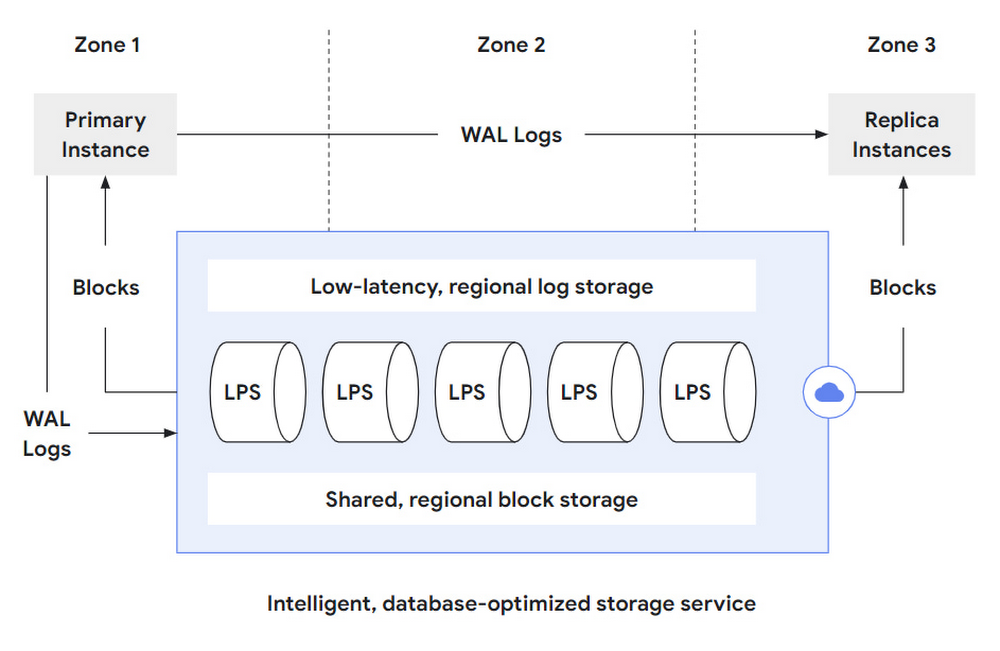
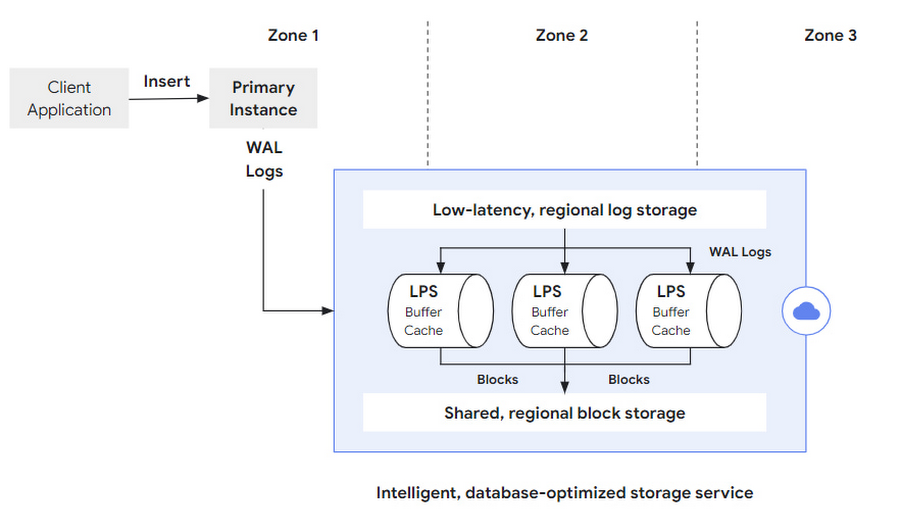
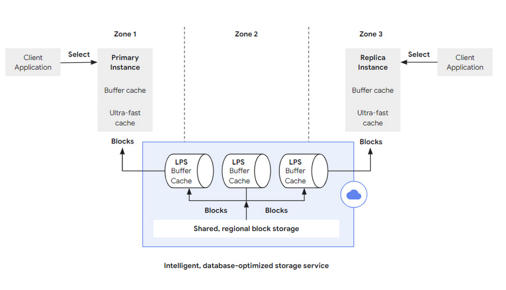
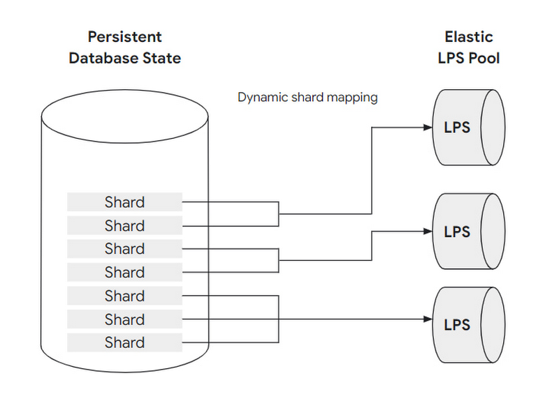

# Disaggregation of compute and storage
- was built on the fundamental principle of disaggregation of compute and storage
- designed to leverage disaggregation at every layer of the stack
- begins by separating the database layer from storage, introducing a new intelligent storage service
- allows AlloyDB to offload many database operations to the storage layer through the use of a log-processing system
- The storage service itself also disaggregates compute and storage, allowing block storage to scale separately from log processing.()
	- In early approaches, though storage could be sized independently from the compute layer, the overall system was still fairly static and lacked elasticity. 
	- By building on cloud-scale storage solutions, next-generation database systems improved on storage elasticity, but still suffered from either oversized storage clusters or a lack of IO capacity in case of workload spikes (hotspots).
	- With AlloyDB, the fully disaggregated architecture even at the storage layer allows it to work as an elastic, distributed cluster that can dynamically adapt to changing workloads, adds failure tolerance, increases availability, and enables cost-efficient read pools that scale read throughput horizontally.
	- Multiple layers of caching throughout the stack, give developers increased performance while retaining the scale, economics, and availability of cloud-native storage. Combined, these aspects of AlloyDB architecture mark the next step of the evolution of disaggregation in databases and contribute to AlloyDB’s exceptional performance and availability.
	
	
# AlloyDB design overview

## procedure

 -  The primary database instance (of which there is only one) persists WAL log entries, reflecting database modification operations (such as INSERT/DELETE/UPDATE) to the low-latency regional log store. 
 - the log processing service (LPS) consumes these WAL records for further, asynchronous  processing. Each log record is processed only once in each zone, resulting in an up-to-data database block that is materialized to a sharded, regional storage system.
 - these blocks can then either be served back to the primary database instance, or to any number of replica instances that might be in any of the zones within the region where the storage service operates.
 - To keep the local caches of the replica instances up-to-date, AlloyDB also streams WAL records from the primary to the replica instances to notify them about recent changes. 
 
 ## benifits
 
 - Full compute/storage disaggregation even within the storage layer. LPS can scale out based on workload patterns, and transparently add more compute resources to process logs when needed to avoid hotspots. Since the log processors are purely compute-attached to a shared regional storage, they can flexibly scale out/in without needing to copy any data.
 - Storage-layer replication: By synchronously replicating all blocks across multiple zones, the storage layer automatically protects the system from zonal failures without any impact on or modifications to the database layer. 
 - Efficient IO paths / no full-page writes: For update operations, the compute layer only communicates the WAL records to the storage layer, which is continuously replaying them. In this design, there is no need to checkpoint the database layer, or any reason to send complete database blocks to the storage layer (e.g., to safeguard against the torn pages problem). This allows the database layer to focus on query processing tasks, and allows the network between the database and storage layer to be used efficiently.
 - Low-latency WAL writing: The use of low-latency, regional log storage allows the system to quickly flush WAL log records in case of a transaction commit operation. As a result, transaction commit is a very fast operation and the system achieves high transaction throughput even in times of peak load.
 - Fast creation of read replica instances: Since the storage service can serve any block in any zone, any number of read replica instances from the database layer can attach to the storage service and process queries without needing a “private” copy of the database. The creation of a read replica instance is very fast as data can be incrementally loaded from the storage layer on demand — there’s no need to stream a complete copy of the database to a replica instance before starting query processing.
 - Fast restart recovery: Since the log processing service continuously replays WAL log records during online operations, the amount of write-ahead log that needs to be processed during restart recovery is minimal. As a consequence, system restarts are accelerated significantly (because WAL-related recovery work is kept to a minimum).
 - Storage-layer backups: Backup operations are completely handled by the storage service, and do not impact the performance and resources of the database layer.
 
 # Life of a write operation
 
 
 ## procedure
 
 - The primary instance processes the statement (updating its data and index structures in-memory) and prepares a WAL log record that captures the semantics of the update operation. 
 - Upon transaction commit, this log record is first synchronously saved to the low-latency regional log storage, 
 - asynchronously picked up by the log processing service in the next step.
 
 ## key points
 - storage layer is intentionally decomposed into separate components  — log storage, log processing, and block storage
 - WAL log writing is an append-only operation, AlloyDB specifically optimizes for this use case with a high-performance, low-latency storage solution
 - WAL log records need to be processed by applying them to the previous version of the block they refer to. 
 
  To do this, the storage layer’s LPS subsystem performs random block lookups and applies PostgreSQL’s redo-processing logic ***in a high performance and scalable way.***(how scalable?)
- multiple instances of the log processing service (LPS) run in each of the zones of the region
	
## questions	
- how to replay wal log in scalable way?
	
# life of a read operation	

## procedure
- first, access buffer cache and ultra-fast cache
- if both of caches are miss, a corresponding block fetch request is sent to the storage layer.
	- Apart from the block number to retrieve, this request specifies a log-sequence number (LSN) at which to read the data
	- The use of a specific LSN here ensures that the database server always sees a consistent state during query processing. 
	- ***This is particularly important when evicting blocks from the PostgreSQL buffer cache and subsequently reloading them***, or when traversing complex, multi-block index structures like B-trees that might be (structurally) modified concurrently.
- the log processing service is also responsible for serving the block fetch requests
	- Every LPS has its own instance of the PostgreSQL buffer cache 
	- If the requested block is not present in the cache, the LPS retrieves the block from the sharded, regional storage and sends it back to the database layer.
	- The log processing service must also do some bookkeeping to track which blocks have log records that have not been processed.

## questions

# Storage layer elasticity

## explains
- database persistence is horizontally partitioned into groups of blocks called shards. 
- Both shards and LPS resources scale horizontally and independently.

## questions

