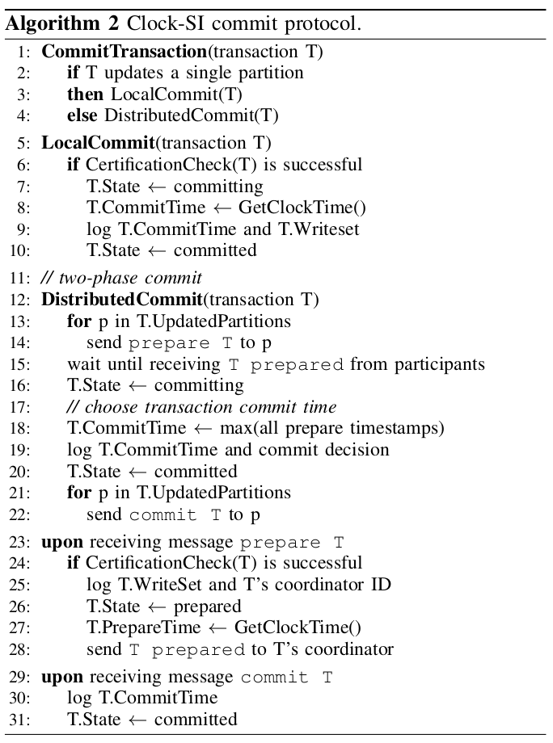

# background
- 论文全称 - Clock-SI: Snapshot Isolation for Partitioned Data Stores Using Loosely Synchronized Clocks

# Existing implementations
## implementaions of SI

# Principle
- Clock-SI uses **loosely synchronized clocks** to assign snapshot timestamp and commit timestamp to transaction 
- partitions do their own certification
- 2pc protocol is used to commit transaction that update multiple partitions

# System Model
- serveral partitions 
- synchronize clock with different speeds using time protocol that likes NTP

# The Definition Of Snapshot Isolation
SI is a MVCC scheme that with 3 properties:
1. each tx reads from a consistent snapshot
	- the snapshot is taken at the start of the tx
	- the snapshot is identified by a snapshot timestamp
	- consistent snapshot means :
		- includes all writes of txs commited before the snapshot timestamp
		- does not include any writes of txs (aborted/commited) after the snapshot timestamp
		
2. txs are commited in a total order. 
	- every commit produces a new db snapshot, which is identified by the commit timestamp

3. an update tx should be aborted if it introduces a write-write conflict with a concurrent commited tx
	- T1 is concurrent with commited update T2, if
		- T1 took its snapshot before T2 commited
		- T2 tries to commit after T2 commited

# Challenges
1. From the SI definition, a consistent snapshot with snapshot timestamp t includes, for each data item, the version written by the transaction with the greatest commit timestamp smaller than t.

2. This property holds independent of 
	- where a transaction starts and gets its **snapshot timestamp**
	- where an update transaction gets its **commit timestamp**
	- where the accessed data items reside
	
3. Ensuring this property is challenging when **assigning snapshot and commit timestamps using local clocks**
	- clock skew may cause a snapshot(T1的snapshot) to be unavailable 
		- unavailable的意思是，该snapshot不符合上述snapshot定义三个属性
		- 此处发生clock-skew： p2的时间落后p1 theta时间
		- unavailable的原因是：SI need to include all writes of txs commited before the snapshot timestamp，下图中时间t'->t这段数据在P2还没有发生呢
	
	
	
	- the pending commit of an update transaction can cause a snapshot to be unavailable
		- pending commit 导致了T2的snapshot不可用，因为t''此处，取任何一个值(之前的或者现在的)，都有可能不符合SI的三个属性
			- we cannot return the value written by T1 , because we do not yet know if the commit will succeed, 
			- but we can also not return the earlier value, because, if T1’s commit succeeds, this older value will not be part of a consistent snapshot at t'' .

# Clock-SI
## Read Protocol

# Commit Protocol

two crucial points should be mentioned:

## timestamp assignment
- When transaction T is initialized at its originating partition (lines 1-3), it receives the snapshot timestamp by reading the local physical clock,

## consistent snapshot reads

### snapshot unavailability due to pending commit
- 此处对应

### snapshot unavailability due to clock skew

# Questions
1. commit protocol为什么没有涉及多个tx write-write的场景？