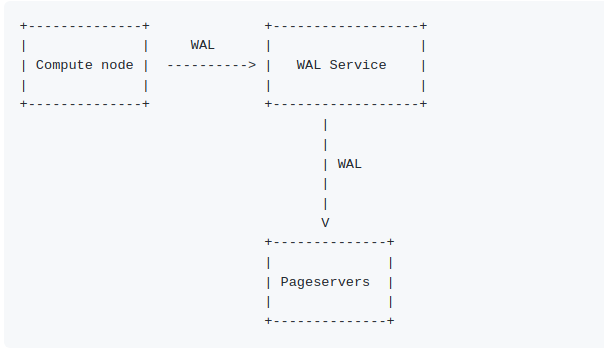
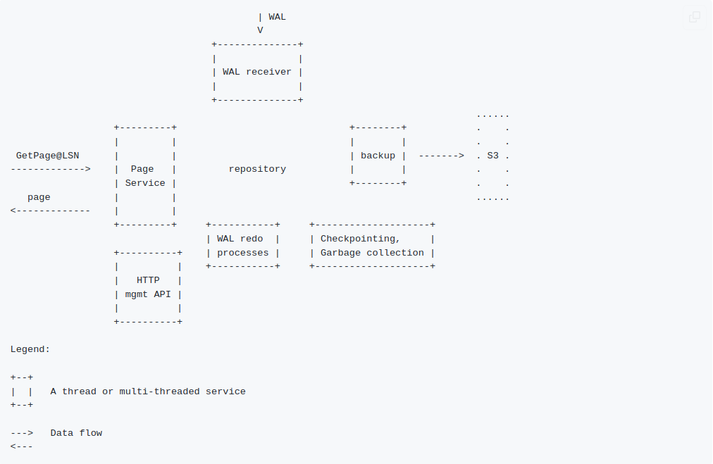

# 基本信息
- source code: https://github.com/neondatabase/neon

# 架构

## major components:
#### Pageserver

Scalable storage backend for the compute nodes.

 - Repository - Neon storage implementation.
 - WAL receiver - service that receives WAL from WAL service and stores it in the repository.
 - Page service - service that communicates with compute nodes and responds with pages from the repository.
 - WAL redo - service that builds pages from base images and WAL records on Page service request

#### WAL service

The service receives WAL from the compute node and ensures that it is stored durably.

# 模块

## Page Server

The Page Server has a few different duties:

 - Respond to GetPage@LSN requests from the Compute Nodes
 - Receive WAL from WAL safekeeper, and store it
 - Upload data to S3 to make it durable, download files from S3 as needed

S3 is the main fault-tolerant storage of all data, as there are no Page Server replicas. We use a separate fault-tolerant WAL service to reduce latency. It keeps track of WAL records which are not synced to S3 yet.

### Services

The Page Server consists of multiple threads that operate on a shared repository of page versions:

#### Page Service

 1. listens for GetPage@LSN requests from the Compute Nodes
 2. responds with pages from the repository
 3. On each GetPage@LSN request, it calls into the Repository function

#### WAL Receiver

The WAL receiver connects to the external WAL safekeeping service using PostgreSQL physical streaming replication, and continuously receives WAL. It decodes the WAL records, and stores them to the repository.

#### Backup service

The backup service, responsible for storing pageserver recovery data externally.

Currently, pageserver stores its files in a filesystem directory it's pointed to. That working directory could be rather ephemeral for such cases as "a pageserver pod running in k8s with no persistent volumes attached". Therefore, the server interacts with external, more reliable storage to back up and restore its state.

The code for storage support is extensible and can support arbitrary ones as long as they implement a certain Rust trait. There are the following implementations present:

local filesystem — to use in tests mainly
AWS S3 - to use in production
The backup service is disabled by default and can be enabled to interact with a single remote storage.

#### Repository background tasks

#### storage
- The page server slices the incoming WAL per relation and page
- packages the sliced WAL into suitably-sized "layer files"
 
