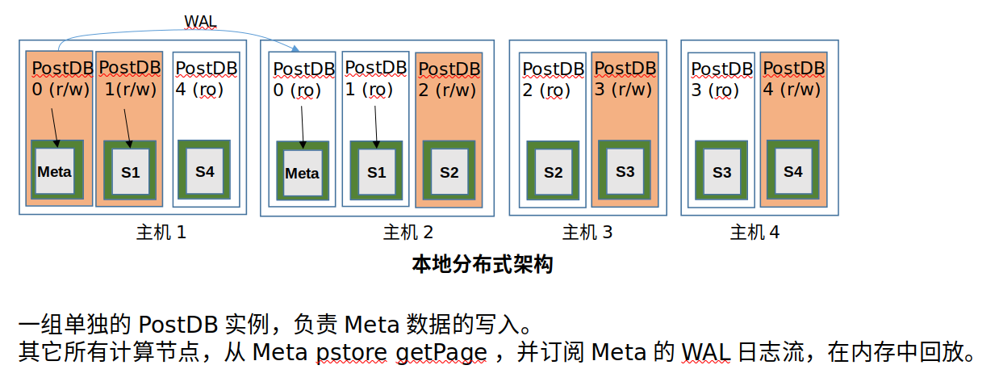

# 需求
1. pcs node之间组成一个高可用集群，通过选举产生leader，pcs leader负责所有pcs逻辑 
2. pcs node本身应该是无状态的 
3. pcs负责选择slice leader
4. pcs负责所有node的下线状态判断
5. 作出node 下线判断后，进行相应调度

# pcs选主
## 选主流程
pcs node 发起 request vote 给 storage node
storage node 在每个term只能给一个pcs node投票
每一轮投票里，得到多数派投票的pcs node被选为leader
当选为 pcs leader的node给其他 pcs node发送心跳
接收到更大term 消息的pcs node，自动转为follower

优化点：
pcs node在给voter 发送request vote时，等到至少多数voter都是Online连接状态时发送
pcs node 在转到新的term时，持久化存储保留该term，重启时load term

异常处理：
storage node保存vote for信息，避免voter在同一个term投2次票

**工作进度：代码已完成**

# pcs 管理哪些数据
slice leader信息
node status信息，如下线状态，cpu使用率， 硬盘使用信息等
为维持node status所采取的相应机制（比如lease机制）的相关数据，如每个node的租约信息

# pcs node间数据的同步和数据持久化
考虑：
- pcs node 无状态，不依赖本地存储，也就是说在另外的node，拉起一个新的pcs node也可以工作
- 将满足多数派的pcs 数据，持久化到meta中

pcs leader内存中的数据，通过数据复制到pcs follower 上，满足quorum多数派要求后，写入到meta postdb中。
网络分区情况下多leader的异常可以避免。

其他node可以通过meta postdb获取pcs 数据

# 选择slice leader
## 策略
根据node的负载，选择负载最小的node成为它所在slice的leader

##  哪些node需要知道slice leader信息
所有业务 node

## 这些node怎么知道某个slice的leader
可以通过Meta信息得到
也可以由pcs leader推送消息

# node下线状态判断
## 利用租期机制
1. 原理上周说过

# node下线后的调度
1. node类型： computer node , slice leader
	1. 重新选择slice leader
	2. 通知新slice leader：原 leader已经下线，需要
	
2. node 类型:  computer node , slice replica 
	通知 slice leader：replica 已下线
	
3. node 类型:  storage node
	？

# 网络分区对PCS的影响

# node fault对PCS的影响

