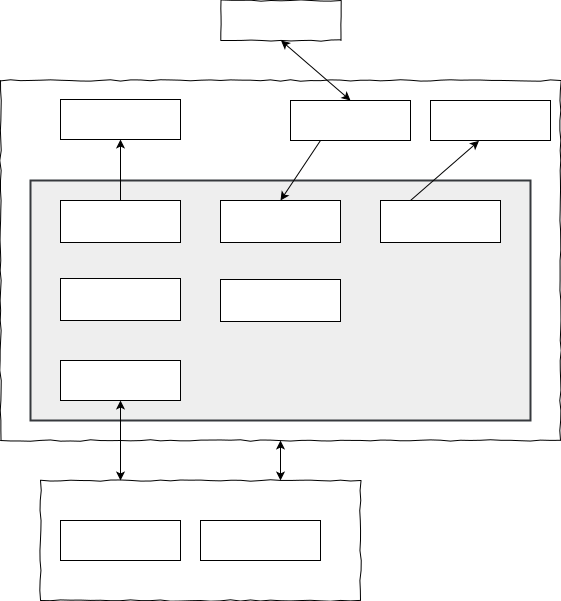

# 背景与目标
- pcs是postdb数据库下的一个模块
- pcs需要收集postdb cluster中所有node的在线状态(通过网络层)
- 在创建table/index/partition等relation,创建对应的分片(shard)时，pcs需要提供对应的策略接口(副本策略，primary shard node选择策略)
- pcs需要应对失效的cluster node(计算节点/存储节点)，进行failover处理
- pcs需要应对shard 容量膨胀情况，进行自动分裂
- pcs需要应对shard 写过热问题，进行自动分裂/平移
- pcs需要支持shard group配置，用户指定的table 中所有shard 存储位置在一起
- pcs需要支持控制命令(日志命令/tracing命令/监控命令等)下发给指定node

# 在系统总体架构中的位置


# 功能
## 模块划分

PCS组件主要存在存在下述需求点：
- 收集cluster中各node的status信息
- 为创建shard提供相关策略支持
- 主动(被动)调度shard：扩容、缩容、平移、分裂等
- 维持PCS组件在cluster中的高可用性，相对应的，PCS之间组成PCS group
- 下发系统命令到指定node

相对应的，PCS由以下模块组成：
- 集群状态 Cluster Status
- 策略控制 Policy Control
- 分片调度 Shard Schedule
- PCS 组控制 PCS Group Control
- 命令中心 Command Center




## 模块
### 集群状态 (cluster status)
#### 业务逻辑
- PCS收集整个集群内所有node的下列状态(暂定，实现时依据其他模块需求增减)
	- 在线(online)情况
	- 地理位置
	- io负载
	- cpu负载
	- memory占用
	- 硬盘空闲容量
	
	
- node在本地收集status信息，通过心跳机制，将status信息报告给pcs所在node的coordinator组件；然后coordinator组件会转发给本模块
- 此信息保存在内存cache中，无需持久化，无需被复制到replica PCS
	- 切换primary pcs场景下，新的primary pcs会重新收集最新cluster node最新状态信息

#### 模块接口

1. 更新node status
```
	fn update_nodes_status(s: &node_status) -> boolean;
```

2.  取得最新node status

```
	fn get_nodes_status() -> node_status;
```


### 策略控制 (policy control)
#### 业务逻辑
##### 副本位置
###### 流程

###### 策略
- 负载均衡策略	
	- 排除哪些节点
		- 硬盘空闲空间 < 某个设置值
		- 当前cpu使用率 > 某个设置值 
		
	- 再考虑shard-group因素：寻找符合shard-group条件的节点(表表关系)
	- 最后使用round robin方法在可用节点上进行选择
		- 可从最简单的策略开始做，后面持续优化

- 灾备策略
	- 主要以存储节点的地理位置为考虑因素，实现灾难备份，如两地三中心，三地五中心等
	- 在存储节点安装时，已经设定地理位置(城市/中心)。此后，系统运行，此信息上报给pcs
	- 给分片副本分配节点时，按中心位置进行分配

- 用户可以设置策略组合：灾备策略 + 负载均衡策略； 负载均衡策略


##### 选择primary shard node
###### 流程


###### 策略
- 选项：
	0. 指定固定节点
	1. 在计算结点间轮转选择，每个节点机会平等；在候选人节点中若存在对应副本节点，优先选择副本节点。（同样要考虑 shard group 因素）
		- - 理论上，我们可以选择所有计算  结点中任何一个。实际上，在本地分布式架构下，计算结点与存储节点物理上相同，这里可以为了优化网络流量，尽量选择与副本在同一个物理机器上的计算结点（因primary shard node负责产生shard wal）

#### 模块接口


### 分片调度 (shade schedule)

### PCS组控制 (PCS group control)

#### 基本形态


- 整个cluster中，pcs 用来控制整个cluster的状态变化。使用pcs group来保证pcs node的可用性
- pcs group之间采用与Raft类似的协议，选举primary pcs节点，并在pcs之间同步元信息


#### pcs 选举
- pcs 节点在进行选举时，状态迁移如下图所示：


- 节点选举是在pcs 节点之间进行的，pcs 节点是candidate 与 follower


#### pcs间元信息同步


- pcs node之间数据同步是通过同步“PCS WAL”到replica pcs 节点完成的
	1. primary pcs节点接收到write请求，写入MetaData Buffer
	2. primary pcs节点生成PCS WAL
	3. PCS WAL同步到replica pcs节点
	4. replica pcs节点收到PCS WAL后，进行持久化并replay WAL，数据写入Buffer	

### 命令中心 (command center)


## 元信息管理
### 元信息类别
- 配置信息
- system table (include partition/table/... 结构元数据)
- shard

- 问题：
1. system table是否应该作为pcs的元信息？ pcs是以extension的方式存在，在pcs内进行create table操作，相应的系统表元数据都在pcs进程内存空间内，那计算

### 元信息的读写场景
- 写(只能在primary pcs上)
	- create table(...) - 创建分片
	- drop table(...) - 回收分片
	- 平移分片(主动/被动)
	- 分裂分片(主动/被动)

- 读(任一个node上(包括pcs meta data learner节点))
	- select
	- insert/update
	- client driver

### partition(table) 与shard的对应关系
- 原生postgresql中可以定义partition分区，指数据以range/list/hash三种方式分配进哪个分区。
```
CREATE TABLE measurement (
    city_id         int not null,
    logdate         date not null,
    peaktemp        int,
    unitsales       int
) PARTITION BY RANGE (logdate);

CREATE TABLE measurement_y2006m02 PARTITION OF measurement
    FOR VALUES FROM ('2006-02-01') TO ('2006-03-01');
	
CREATE TABLE measurement_y2006m03 PARTITION OF measurement
    FOR VALUES FROM ('2006-03-01') TO ('2006-06-01') partition by range(peaktemp);
	
create table measurement_y2006m03_pt PARTITION of measurement_y2006m03  FOR VALUES FROM (1) to (10);	

```

- postdbv4中，shard指的是数据存在哪里。shard管理模块不需要关注复杂的partition分区方式，但是需要知道哪个表有哪些partition(partition name)
- partition与shard的对应关系
	- 创建partition(table)时，shard也相应被创建
		- 初始时，partition与shard在数量上是一一对应的
		- 随着数据的更多写入，shard会自动分裂
	- partition(table)被drop时，shard也相应被回收: v3
	- detach


## shard调度管理
### shard分片策略

#### 分片方式
在分片调度层面，分片方式决定了数据被存入了哪个分片。
- range
		1. 基于range的分片很容易实现自动分片：只需拆分或合并分片。使用基于哈希的分片的系统实现自动分片代价很高昂
		2. 相对于hash分片，基于range的分片在进行“范围查询”时有优势
		3. 数据分布不均匀，基于range的分片可能会带来读取和写入热点，可以通过拆分、复制和移动分片消除这些热点。

- hash
	- hash mod
		1. 数据分布相对均匀
		2. 随即读写单条数据较快
		3. 分裂分片时，不好处理
		4. 缩容/扩容时，节点变动导致全部分片/数据变动位置。
		5. 查询范围数据效率低

	- 一致性hash
		1. 数据分布相对均匀
		2. 随即读写单条数据较快
		3. 能较好兼容分裂/缩容/扩容
		4. 查询范围数据效率低


### 创建shard
*- 在执行create table(或类似的创建类DDL语句)时，在primary pcs上执行创建逻辑
- 将create执行的结果保存进primary pcs meta data*
- 根据分片策略，计算shard 的 数量，range等
- 根据分片策略，计算shard 所在的 nodes（存储节点） ，并选择primary shard node（计算结点）
*- 将上述信息写入primary pcs的metadata，并同步PCS WAL到replica pcs*
*- replica pcs持久化并回放PCS WAL*
- 若Quorum成功
- primary pcs 通知指定node为primary shard node以及*发送给它相关的shard信息(*)，此后关于此shard的事宜由此node负责


### 回收shard
*- 在执行drop table(或类似的创建类DDL语句)时，在primary pcs上执行回收逻辑
- 从metadata中查询目标分片的primary shard node位置
- 发送命令给primary shard node - 回收shard
- primary shard node执行命令成功
- pcs 清除metadata中对应shard信息(标记)
- 同步到relica pcs中*

- 提供一个api，清除自身相应元信息缓存

### 分裂shard
- 建议使用一致性hash作为shard分裂的方式。

- 在hash环上新增一个节点。如下图中t4


### 平移分片
- 将某分片从一个node平移到另一个node
- 移动过程中，不影响当前正在进行的服务（热切换）

### Failover
集群在服务过程中，一个服务节点(计算结点或者存储节点，或者同时)发生了crash。 为了提升cluster的可用性，pcs需要进行failover处理

#### 计算结点crash
- 重新计算原属于该节点的primary shard node
- 需要先从元信息取得primary shard node在该节点上的shard
- 计算新的primary shard node完成后，更新元信息，并通知新节点相关shard元信息

#### 存储节点crash
- 重新计算原副本位置在此节点上的shard的副本位置
- 需要先从元信息取得原副本位置在该节点上的shard
- 计算新的副本位置完成后，更新元信息，并通知primary shard node同步shard数据

## 控制命令下发
- 日志命令
- tracing
- 监控


# 状态迁移


