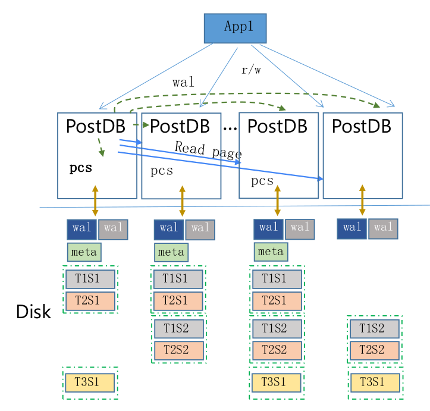
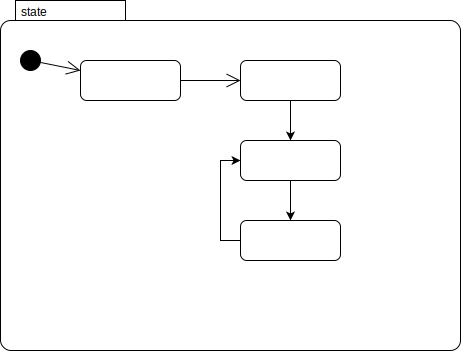
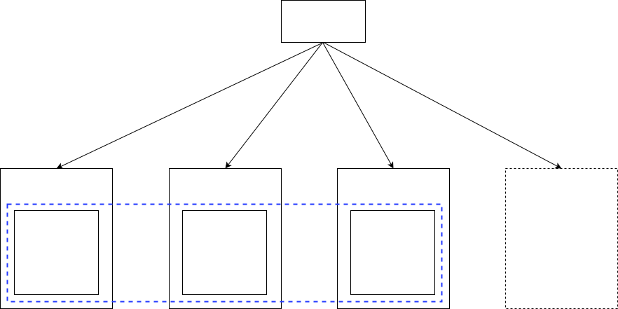
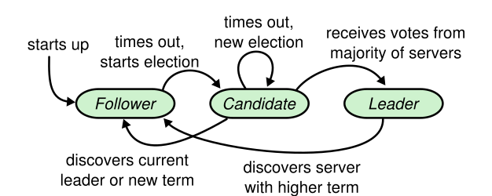
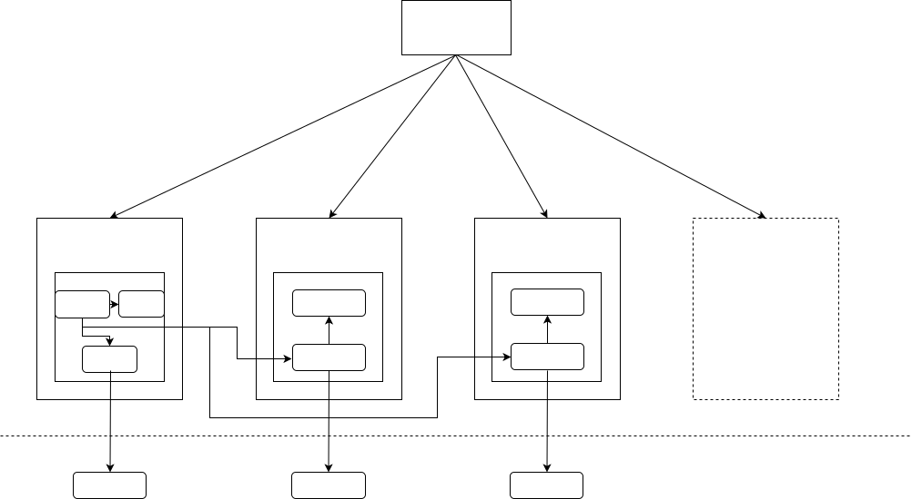

# 背景与目标

# 在postdb-v4系统中的位置

# 状态图

## pcs node 状态

- pcs_election - 选举 primary pcs
- pcs_recovery - pcs数据recovery
- pcs_running - 正式提供pcs 服务，此状态是pcs node的稳定态

# 功能
## pcs group

- 整个cluster中，pcs 用来控制整个cluster的状态变化。使用pcs group来保证pcs node的可用性
- pcs group之间采用与Raft类似的协议，选举primary pcs节点，并在pcs之间同步元信息

### pcs 选举

- pcs 节点在进行选举时，状态迁移如下图所示：

- 节点选举是在pcs 节点之间进行的，pcs 节点是candidate 与 follower

## pcs间元信息同步

- pcs node之间数据同步是通过同步“PCS WAL”到replica pcs 节点完成的
	1. primary pcs节点接收到write请求，写入MetaData Buffer
	2. primary pcs节点生成PCS WAL
	3. PCS WAL同步到replica pcs节点
	4. replica pcs节点收到PCS WAL后，进行持久化并replay WAL，数据写入Buffer	

## pcs元信息
### 元信息类别
- 配置信息
- system table (include partition/table/... 结构元数据)
- shard

### 元信息的读写场景
- 写(只能在primary pcs上)
	- create table(...) - 创建分片
	- drop table(...) - 回收分片
	- 平移分片(主动/被动)
	- 分裂分片(主动/被动)

- 读(任一个node上(包括pcs meta data learner节点))
	- select
	- insert/update
	- client driver

### shard/shard group管理
#### 创建shard
##### 分片策略
- 建议以range作为shard分片的方式，
	1. 
	
- 位置分布(选定分片所在节点)
	- 负载均衡(考虑地理位置，节点负载，shard-group等因素)
	
- shard-group策略
	- 用户可设置，优化系统效率

##### 业务流程
- 在执行create table(或类似的创建类DDL语句)时，在primary pcs上执行创建逻辑
- 根据分片策略，计算shard 的 key range
- 根据分片策略，计算shard 所在的 nodes(包括primary shard/replica shard) 
- 将上述信息写入primary pcs的metadata，并同步PCS WAL到replica pcs
- replica pcs持久化并回放PCS WAL
- Quorum成功，选择primary shard node
- primary pcs 通知指定node为primary shard以及相关的shard信息，此后关于此shard的事宜由此node负责

#### 回收shard
- 在执行drop table(或类似的创建类DDL语句)时，在primary pcs上执行回收逻辑
- 从metadata中查询目标分片的primary shard node位置
- 发送命令给primary shard node，回收shard实例
- 清除metadata中对应shard信息(标记)
- 同步到relica pcs中

#### 读一致性
- 每个wal都是逻辑上独立的，pcs wal也是同样的

## cluster node状态管理
- primary pcs利用心跳机制定时收集cluster内各node的状态，包括：
	- 在线情况
	- 其他业务指标(地理位置，shard数，shard总占用资源，io负载，cpu负载，memory占用，硬盘空闲容量等)
- 此状态信息保存在内存cache中，无需持久化，无需被复制到replica pcs: 切换primary pcs场景下，新的primary pcs会重新收集最新cluster node最新状态信息

## 控制命令下发
- 日志命令
- tracing
- 监控

# question
1. Online DDL：
元数据的变更，由PCS 写入，每个表有自己的元数据多版本;
