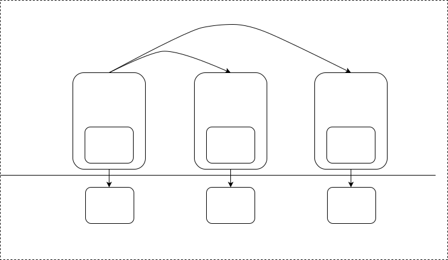

# 背景与目标

# 在postdb-v4系统中的位置

# 状态图

## pcs node 状态

- pcs_recovery - pcs数据recovery
- pcs_election - 选举 primary pcs
- pcs_running - 正式提供pcs 服务

# 功能

## pcs 选举

## cluster node状态管理

- primary pcs利用心跳机制定时收集cluster内各node的状态，包括：
	- 在线情况
	- 其他业务指标(shard数，shard总占用资源，io负载，cpu负载，memory占用，硬盘空闲容量等)
- 此状态信息保存在内存cache中，无需持久化，无需被复制到replica pcs: 切换primary pcs场景下，新的primary pcs会重新收集最新cluster node最新状态信息

## 系统元信息
### 元信息类别
- shard 元信息: shard id/key range of shard/primary node/replica nodes
- shard-group 元信息
- 配置信息

### 元信息同步机制

#### 使用raft协议进行元信息同步

#### shard/shard group元信息的读写
- 写(只能在primary pcs上)
	- create table(index...) - 创建分片
	- drop table(index...) - 回收分片
	- 平移分片
	- 分裂分片
	- 合并分片

- 读(任一个pcs上)
	- select
	- insert/update
	- ...

- 效率 - 数据插入/修改/删除操作只需要从pcs读，不涉及raft一致性操作，数据读写效率不受影响

## shard/shard group管理

### 创建shard
#### 分片策略
- key range公式模板 - 1. 按容量切割  2. [start -end) 
- 位置分布(primary shard/replica shard)
	- 指定机器
	- 负载均衡
	- 考虑地理位置
- 副本数(全局参数)
- shard-group策略
	- 用户可设置，优化系统效率

#### 逻辑
- 在primary pcs上执行创建逻辑
- 根据分片策略，计算shard type的 key range，此range为一个左闭右开的区间
- 根据分片策略，计算primary shard 所在的node 
- 根据分片策略，计算replica shards 所在的nodes
- 每个shard实例(包括primary shard/replica shards)都是同一个shard-id
- 将上述信息写入metadata，并同步到replica pcs/learner
- primary pcs 通知指定node为primary shard

### 回收shard
#### 逻辑
- 在primary pcs上执行回收逻辑
- 从metadata中查询目标分片的所有实例位置
- 调用存储层接口，在指定节点回收shard实例
- 清除metadata中对应shard信息
- 同步到relica pcs中

### 平移/分裂/合并
- waiting

## 扩容/缩容
- waiting

## 控制命令下发
### 下发机制
### 命令类型
- 配置（WAL）
	- 整体配置
	- 单项配置
- 日志命令
- tracing
- 监控

# question
1. Online DDL：
元数据的变更，由PCS 写入，每个表有自己的元数据多版本;
