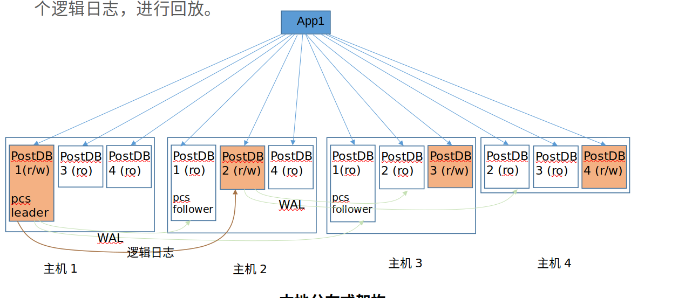

# 对架构的一些理解
## 将单机多日志流分解成单机单日志流
- 分片副本数：固定数目n
- 分片数 = 主机数
- 一分片包含一个主分片n-1个副分片
- 一计算节点主机承载一个主分片和n-1个其他分片的副分片
- 写操作在主分片上进行
## 支持多写
- 驱动端分解计划
- node端分解计划
## 数据寻址
- 由一致性hash算法(或与range/list的组合)决定数据存储在哪个分片

# 对PCS的影响
## 计算主分片的位置
由于每个主机一个主分片，无需再计算。因此pcs也无需计算主分片的位置。

## 计算副本的位置
- 在扩容/缩容时，会发生分片迁移，此时需要考虑计算副本位置。

问题：在正常运行时，需要PCS计算副本位置吗？
- 在每个主机上，副本个数是相同的。可以预置分片副本位置（写入系统表中），无需PCS参与。因此也无需提供副本位置。

## 扩容/缩容
- 会发生分片迁移，此时需要考虑计算副本位置。
此时副本位置算法是
	1. 随机分配，并保证每个主机上副本数想等？
	2. 按主机负载和分片副本读压力匹配的原则？

# 命令下发
- 基本无变化

# 集群状态
- 问题：目前系统内有没有要考虑依据负载进行决定的场景？如没有，则无须保留此功能

## PCS 选举
- pstore独立出去后，是在PCS node之间投票决定PCS leader，还是由Pstore节点来投票（类似于V3）？
应该还是在PCS节点之间投票，因为新方案中，pstore的数量是动态变化的

