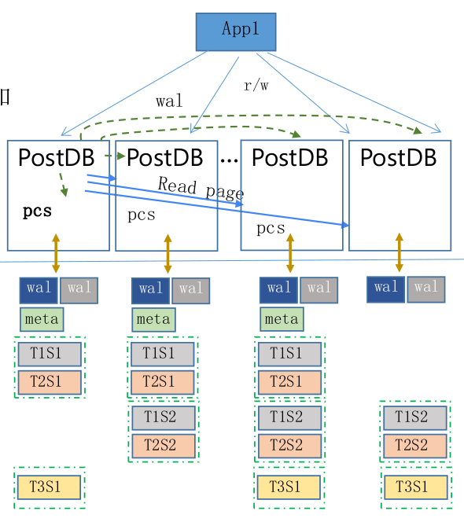

# 需求
## V3版本中存在的问题

## V4的目标

# 本地化架构、理解、问题

## 初始化流程

## 写流程

## 读流程

## 增加/减少node

## pcs的功能
- 进行shard leader election，确定shard的leader
- 在shard和shard group被创建完成后，记录相关信息到meta data中，并作持久化
- 响应node状态变化(新增/减少)
	- 新增node时，pcs根据负载均衡原则调整shard分布，从负载重的node reload一些shard-group到新的node，并更新meta data
	- node减少时，从meta data中取得该node的shard/shard group/wal信息，pcs根据负载均衡原则调整shard分布，并在目标node中replay相关wal

## question
0. 每个node上wal与shard的对应关系?
0. shard什么被创建？ - 在wal被创建之后？
1. shard的key：wal lsn？
3. shard key-range生成策略
	- 范围
		- 因lsn的最新值是不断增长的，怎么处理？
		- 要考虑负载均衡问题
		- 要考虑范围大小，这关系到
	- 时机 - shard创建之时
2. 响应node变化(增加/减少)
	- 引起sharding key range的变化 - 要及时推送到存储层，重构存储
	
3. sharding元信息保存在pcs内存，并持久化到disk

