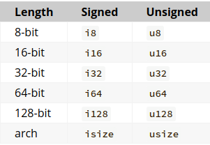
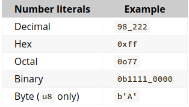

# 数据类型
## 布尔
- two possible values: true and false
- one byte in size
- specified using "bool" keyword

```
fn main() {
    let t = true;

    let f: bool = false; // with explicit type annotation
}
```

## 字符/字符串

## 数值
### 浮点 (float)
- floating-point types are f32 and f64, which are 32 bits and 64 bits in size, respectively
- The default type is f64 because on modern CPUs 
- f64 is the same speed as f32
- f64 is capable of more precision than f32
- All floating-point types are signed.

```
fn main() {
    let x = 2.0; // f64

    let y: f32 = 3.0; // f32
}
```


### 整数 (decimal)





## 枚举 (enum)


## 哈希 (hash)


## 结构 (struct)

```
struct Point {
    x: f32,
    y: f32,
}
```


## 元组 (tuple)
-  group together a number of values with a variety of types into one ***compound type***
-  fixed length: once declared, they cannot grow or shrink in size

```
fn main() {
    let tup = (500, 6.4, 1);

    let (x, y, z) = tup;

    println!("The value of y is: {y}");
}
```

## 数组 (array)
- 按顺序存储在内存中的相同类型对象的集合
- 数组的长度或大小等于数组中的元素数
- 数组大小可在代码中指定，或者由编译器决定

```
fn main() {
let months = ["January", "February", "March", "April", "May", "June", "July",
              "August", "September", "October", "November", "December"];
			  
let a: [i32; 5] = [1, 2, 3, 4, 5];

let a = [1, 2, 3, 4, 5];
}


```

## 矢量 (vector)
- 存储相同类型的多个变量
- 大小可随时增加或者缩小(在编译时，大小随时间更改的功能是隐式的) (与map类似？)

```
let v: Vec<i32> = Vec::new();

let v = vec![1, 2, 3];

v.push(5);
v.push(6);
v.push(7);
v.push(8);

let third: &i32 = &v[2];
println!("The third element is {}", third);

let third: Option<&i32> = v.get(2);
match third {
    Some(third) => println!("The third element is {}", third),
    None => println!("There is no third element."),
}

```

# 流程控制
## 分支 - if/else
- if 和 else 关键字与表达式一起用于测试值并根据测试结果执行操作

```
if 1 == 2 {
    println!("True, the numbers are equal."); // 
} else {
    println!("False, the numbers are not equal.");
}
```
-  if 块也可充当表达式

```
let formal = true;
let greeting = ***if formal*** { // if used here as an expression
    "Good day to you."     // return a String
} else {
    "Hey!"                 // return a String
};
println!("{}", greeting)   // prints "Good day to you."
```

## 分支 - match

Rust provides pattern matching via the match keyword, which can be used like a C switch. The first matching arm is evaluated and all possible values must be covered.

```
fn main() {
    let number = 13;
    // TODO ^ Try different values for `number`

    println!("Tell me about {}", number);
    match number {
        // Match a single value
        1 => println!("One!"),
        // Match several values
        2 | 3 | 5 | 7 | 11 => println!("This is a prime"),
        // TODO ^ Try adding 13 to the list of prime values
        // Match an inclusive range
        13..=19 => println!("A teen"),
        // Handle the rest of cases
        _ => println!("Ain't special"),
        // TODO ^ Try commenting out this catch-all arm
    }

    let boolean = true;
    // Match is an expression too
    let binary = match boolean {
        // The arms of a match must cover all the possible values
        false => 0,
        true => 1,
        // TODO ^ Try commenting out one of these arms
    };

    println!("{} -> {}", boolean, binary);
}

```


- 合并多个测试条件

```
let num = 500 // num variable can be set at some point in the program
let out_of_range: bool;
if num < 0 {
    out_of_range = true;
} else if num == 0 {
    out_of_range = true;
} else if num > 512 {
    out_of_range = true;
} else {
    out_of_range = false;
}
```

## 循环
### loop
```
fn main() {
    ***loop*** {
        println!("again!");
    }
	
	
	let mut counter = 0;

    let result = ***loop*** {
        counter += 1;

        if counter == 10 {
            break counter * 2;
        }
    };

    println!("The result is {result}");
}


fn main() {
    let mut count = 0;
    'counting_up: ***loop*** {
        println!("count = {count}");
        let mut remaining = 10;

        ***loop*** {
            println!("remaining = {remaining}");
            if remaining == 9 {
                break;
            }
            if count == 2 {
                break 'counting_up;
            }
            remaining -= 1;
        }

        count += 1;
    }
    println!("End count = {count}");
}

```


### while

```
fn main() {
    let mut number = 3;

    while number != 0 {
        println!("{number}!");

        number -= 1;
    }

    println!("LIFTOFF!!!");
}
```


### for .. in

```
fn main() {
    let a = [10, 20, 30, 40, 50];

    for element in a {
        println!("the value is: {element}");
    }
}

fn main() {
    for number in (1..4).rev() {
        println!("{number}!");
    }
    println!("LIFTOFF!!!");
}
```


# 变量
- variables are immutable by default 
- constants
	- constants values that are bound to a name 
	- are not allowed to change
- differences between constants and variables
	- not allowed to use mut with constants, as constants is always immutable
	- declare constants using the const keyword instead of the let keyword
- shadowing
	- concept: declare a new variable with the same name as a previous variable - the first variable is shadowed by the second
	- meaning: the second variable is what the compiler will see when you use the name of the variable
	- the second variable overshadows the first, taking any uses of the variable name to itself until either it itself is shadowed or the scope ends
	- what is this feature for?

```
// mutable variable
fn main() {
    let mut x = 5;
    println!("The value of x is: {x}");
    x = 6;
    println!("The value of x is: {x}");
	
	
	const THREE_HOURS_IN_SECONDS: u32 = 60 * 60 * 3;
}

// shadowing
fn main() {
    let x = 5;

    let x = x + 1;

    {
        let x = x * 2;
        println!("The value of x in the inner scope is: {x}");
    }

    println!("The value of x is: {x}");
}


```

# 函数
## normal function

```
fn plus_one(x: i32) -> i32 {
    x + 1;
}
```

## async function
```
async fn regular_example() { }
```

## 关联函数(associate functions)
关联函数是指第一个参数不是self(的各种形式)但和Struct有关联关系的函数。关联方法类似于其他语言中类方法或静态方法的概念。

调用关联方法的语法StructName::func()。例如，String::from()就是在调用String的关联方法from()。

```
struct Rectangle {
  width: u32,
  height: u32,
}

impl Rectangle {
  // 关联方法new：构造Rectangle的实例对象
  fn new(width: u32, height: u32) -> Rectangle {
    Rectangle { width, height }
  }
}

impl Rectangle {
  fn area(&self) -> u32 { self.width * self.height }
}

fn main() {
  // 调用关联方法
  let rect1 = Rectangle::new(30, 50);
  let rect2 = Rectangle::new(20, 50);
  println!("{}", rect1.area());
  println!("{}", rect2.area());
}

```

## 闭包

# 内存管理

# 错误处理

# RAII
- Rust enforces RAII
- whenever an object goes out of scope, its destructor is called and its owned resources are freed.

# OwnerShip & Move
## rules
- one resource can only have one owner
- ownership transferred when
	- doing assignments (let x = y) or
	- passing function arguments by value (foo(x))
- After moving resources, the previous owner can no longer be used

## 区分Ownership转移
- 不是所有assign或者“传参”都是Move
- 需要区分什么情况下是copy，什么情况下是move (如：引用不是move)

## Mutability change
Mutability of data can be changed when ownership is transferred.

# Borrow
## concept
- objects can be passed by reference (&T)
- borrow mechanism is based on reference 
- The compiler statically guarantees (via its borrow checker) that references always point to valid objects
- while references to an object exist, the object cannot be destroyed. 即：被借用且没有归还的object resource，不能被move ownership

## mutable
- 传递引用，使用borrow时，可以使用mut修饰。
- 变量mut属性在borrow语境下的影响，类似c++ 下const
	- 原变量immutable，borrow时mutable的，最终不能mutable
	- 原变量mutable, borrow时immutable的，最终不能mutable


## ref pattern


# 模块/包/箱
- 包：
	- 包含一个或多个 crate 内的功能。
	- 包括有关如何生成这些 crate 的信息。 该信息位于 Cargo.toml 文件中。
- 箱：
	- 是编译单元，即 Rust 编译器可以运行的最小代码量。
	- 编译完成后，系统将生成可执行文件或库文件。
	- 其中包含未命名的隐式顶层模块。
- 模块：
	- 是箱内的代码组织单位（或为嵌套形式）。
	- 可以具有跨其他模块的递归定义。
	
# 特征 trait	
特征定义了一个可以被共享的行为，只要实现了特征，你就能使用该行为。

```
#![allow(unused)]
fn main() {
pub trait Summary {
    fn summarize(&self) -> String;
}
}
```

# 泛型 Generics
## where关键字
- 当分别指定泛型的类型和约束会更清晰时：

```
impl <A: TraitB + TraitC, D: TraitE + TraitF> MyTrait<A, D> for YourType {}

// 使用 `where` 从句来表达约束
impl <A, D> MyTrait<A, D> for YourType where
    A: TraitB + TraitC,
    D: TraitE + TraitF {}

```
- 当使用 where 从句比正常语法更有表现力时。本例中的 impl 如果不用 where 从句，就无法直接表达。
```
use std::fmt::Debug;

trait PrintInOption {
    fn print_in_option(self);
}

// 这里需要一个 `where` 从句，否则就要表达成 `T: Debug`（这样意思就变了），
// 或者改用另一种间接的方法。
impl<T> PrintInOption for T where
    Option<T>: Debug {
    // 我们要将 `Option<T>: Debug` 作为约束，因为那是要打印的内容。
    // 否则我们会给出错误的约束。
    fn print_in_option(self) {
        println!("{:?}", Some(self));
    }
}

fn main() {
    let vec = vec![1, 2, 3];

    vec.print_in_option();
}

```

# 一些不容易理解(奇怪)的语法(语法糖)
## Option
Option 代表可能为空可能有值的一种类型，本质上是一个枚举，有两种分别是 Some 和 None。Some 代表有值，None 则类似于 null，代表无值。

使用unwrap()获得实体, refer to official doc:

Returns the contained Some value, consuming the self value.
Because this function may panic, its use is generally discouraged. Instead, prefer to use pattern matching and handle the None case explicitly, or call unwrap_or, unwrap_or_else, or unwrap_or_default.
Panics
Panics if the self value equals None.

## Result

## Some
只有 Option 和 Result，Some 只是 Option 的一个值包装类型。

## ?

## unit () 
The () type, also called “unit”.  - 相当于 void in c?

The () type has exactly one value (), and is used when there is no other meaningful value that could be returned. () is most commonly seen implicitly: functions without a -> ... implicitly have return type (), that is, these are equivalent:

```
fn long() -> () {}

fn short() {}
```

