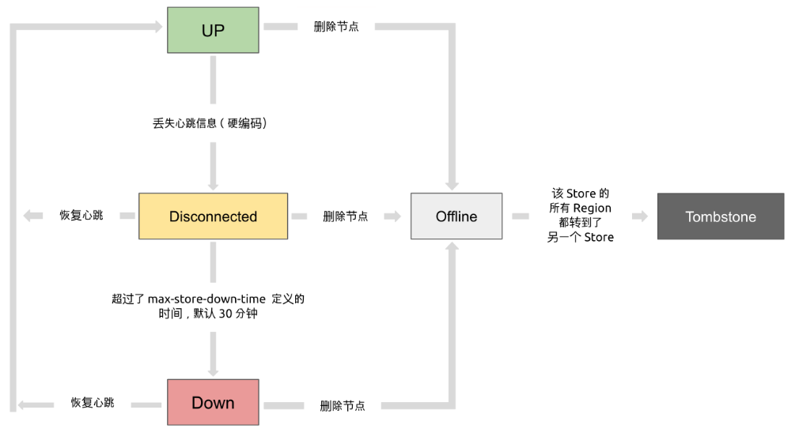
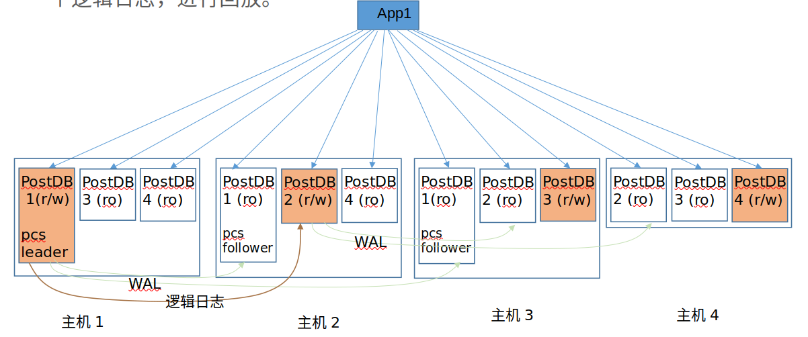

# Node Failure
有两种情况可以从PCS端视角视为Node Failure:
1. 网络故障
2. 主机crash

# 思路
集群节点可以申请一个有时间限制的租约，超过时间就过期。如果节点要延长访问时间，可以在到期前续租。

用PCS实现租约机制，可以提供容错性和一致性。

租约有一个“存活时间”值，即租期。

PCS Leader负责创建颁发租约，并追踪租约的租期是否超时。
PCS Followers不用追踪超时时间。
这么做是因为PCS Leader要用自己的单调时钟决定租约何时过期，然后，让PCS Followers知道租约何时过期。
这样做可以保证，在PCS中，节点会对租约过期这件事能够达成共识。

当一个节点成为了领导者，它就开始追踪租约了。

集群节点负责向PCS Leader申请注册租约，并在租约有效期内负责更新这个租约，即续约。

PCS Leader接收到申请以后，检查租约是否重复（若重复就拒绝），创建租约，并将之向 PCS Followers 进行复制，以提供容错性。

租约复制成功（达到多数派条件）后，PCS Leader将租约发送给申请节点。双方开始履行租约。

# 问题
## lease机制怎么检测并处理Node Failure
由于lease(租约)拥有“期限”，可以非常好的容错网络异常。
当“租期”内网络出现分区、异常，在“租期”内仍然不会影响进程的正常工作，只是不能进行“续租”而已，如果网络能在“租期”耗尽前恢复，使得被授予者能够在租期内成功续约，则不会产生任何异常。

由于lease(租约)能够自动释放，可以很好的容错宕机问题。
当获得lease(租约)的节点宕机后，“租期”耗尽时，自动释放，使得其他节点能够重新获取lease(租约)。


## lease的期限选多长？
如果 lease 的时长太短，一旦出现网络抖动 lease 很容易丢失，从而造成节点失去 lease，使得依赖 lease 的服务停止；
如果 lease 的时长太大，则一旦接受者异常，颁发者需要过长的时间收回 lease 承诺。

使用 lease 确定节点状态时，若 lease 时间过短，有可能造成网络瞬断时节点收不到 lease 从而引起服务不稳定
若 lease 时间过长，则一旦某节点宕机异常，需要较大的时间等待 lease 过期才能发现节点异常。

## lease中时间同步问题
lease机制中，PCS与各节点都在各自的单调时钟下判断时间，怎么处理基准时间不同步的问题？

## PCS Leader怎么将lease信息同步给PCS follower？
从具体实现上看，有几种方式：
1. PCS Leader将租约颁发和租约过期写入自己的日志，并持久化到计算节点本地后，再同步到PCS follower（Quorum协议？）
2. PCS Leader将租约颁发和租约过期写入系统表，由系统表同步机制同步到PCS follower（Quorum协议？）


将lease机制引入PCS后，PCS将从无状态变为有状态。那么PCS选主策略，是否也要发生相应的改变？

##  PCS重新选主，lease数据怎么处理
新主应加载所有lease数据，并给所有lease主动续期，以便租约持有节点连接上来并续期

==========================================================================================================
# 可以参考的其他系统
## etcd
etcd 提供了有时间限制的租约设施，客户端可以用其协调其活动，以及分组成员信息和失效检测。

```
type Lease struct {
	ID           LeaseID
	ttl          int64 // time to live of the lease in seconds
	...
	// expiry is time when lease should expire. no expiration when expiry.IsZero() is true
	expiry time.Time

	...
}
```


主逻辑：由client申请注册一个lease，租期为ttl, server端leader同意注册，并负责检测lease过期情况

lease过期检测：比较 expiry 时间 与 当前服务器时间

续期：client端发起，server端更新 expiry。

lease 信息持久化与节点同步： 通过raft持久化并同步lease信息

leader切换：新leader成为leader后，从持久化存储读取并重建lease列表


## tidb-placement driver



Up：表示当前的 TiKV Store 处于提供服务的状态。
Disconnect：当 PD 和 TiKV Store 的心跳信息丢失超过 20 秒后，该 Store 的状态会变为 Disconnect 状态，当时间超过 max-store-down-time 指定的时间后，该 Store 会变为 Down 状态。
Down：表示该 TiKV Store 与==集群失去连接的时间已经超过了 max-store-down-time 指定的时间，默认 30 分钟。超过该时间后，对应的 Store 会变为 Down，并且开始在存活的 Store 上补足各个 Region 的副本。 #2196F3==
Offline：当对某个 TiKV Store 通过 PD Control 进行手动下线操作，该 Store 会变为 Offline 状态。该状态只是 Store 下线的中间状态，处于该状态的 Store 会将其上的所有 Region 搬离至其它满足搬迁条件的 Up 状态 Store。当该 Store 的 leader_count 和 region_count (在 PD Control 中获取) 均显示为 0 后，该 Store 会由 Offline 状态变为 Tombstone 状态。在 Offline 状态下，禁止关闭该 Store 服务以及其所在的物理服务器。下线过程中，如果集群里不存在满足搬迁条件的其它目标 Store（例如没有足够的 Store 能够继续满足集群的副本数量要求），该 Store 将一直处于 Offline 状态。
Tombstone：表示该 TiKV Store 已处于完全下线状态，可以使用 remove-tombstone 接口安全地清理该状态的 TiKV。

tidb-placement driver在节点断连30分钟后，直接判断为下线，开始节点数据迁移。


# 建议方案
## 1
方案同tidb - placement driver，设置一个长时间的断连时间（PD为30分钟），保证节点大概率真实下线。


优点：
- 简单，有效
- pcs 是无状态的，无需信息同步
缺点：不能对节点故障及时反应，灵敏性不好
## 2
a. lease client 向 lease server申请 lease, 包括 [leaseID, ttl 租期, expiry_time1 过期时间]
b. lease server 接收到申请，更新 lease信息为 [leaseID, ttl 租期, expiry_time2 过期时间]
expiry_time2 = 收到申请时间 + ttl + 时钟漂移补差，这样保证了server中lease 的过期时间 > client 中lease的过期时间，即：client 一定会比 server先过期，从而避免了网络分区下的双主问题
时间漂移补差是对client和server的硬件时间流逝速度不同的补偿，一般不存在这种情况。

c. lease server 同步lease信息到lease client
d. lease server 颁发lease 给 lease client

优点：有效应对了node fault的场景，特别是网络分区下的双主问题
缺点：节点受租约限制，在pcs全down的情况下，租约不能续租，到期后不能工作

=====================================================================



# 要解决的问题
- lease中过期时间判断
- PCS Leader是否需要将lease信息同步给PCS follower?
- PCS Leader怎么将lease信息同步给PCS follower？
从具体实现上看，有几种方式：
1. PCS Leader将租约颁发和租约过期写入自己的日志，并持久化到计算节点本地后，再同步到PCS follower
2. PCS Leader将租约颁发和租约过期写入系统表，由系统表同步机制同步到PCS follower

=============================================

如果PCS leader与拥有租约的节点，同时进行过期时间判断，那么又存在下述问题：

PCS与拥有租约的节点都在各自的单调时钟下判断时间，怎么处理基准时间不同步？

在Postdbv4中，PCS与数据访问活动是分离的。

那么在租约过期时间判断上，只凭PCS leader来判断，可能会导致双主（因为拥有租约的节点并不知道自己过期，还一直在接收数据访问请求）。

etcd为什么可以只在Primary Server上进行判断就可以呢？

因为在etcd中，数据访问活动与lease过期判断都在primary server进行决策，lease 信息对于数据访问活动来说，是实时信息，所以Primary Server可以独立决定node或者region的租约状态。
