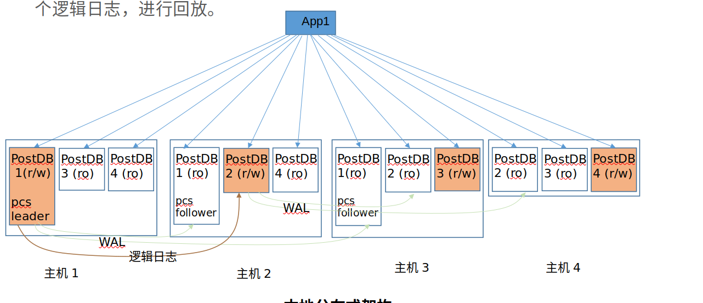

# Node Failure
有两种情况可以从PCS端视角视为Node Failure:
1. 网络故障
2. 主机crash

# 思路
集群节点可以申请一个有时间限制的租约，超过时间就过期。如果节点要延长访问时间，可以在到期前续租。

用PCS实现租约机制，可以提供容错性和一致性。

租约有一个“存活时间”值，即租期。

PCS Leader负责创建颁发租约，并追踪租约的租期是否超时。
PCS Followers不用追踪超时时间。
这么做是因为PCS Leader要用自己的单调时钟决定租约何时过期，然后，让PCS Followers知道租约何时过期。
这样做可以保证，在PCS中，节点会对租约过期这件事能够达成共识。

当一个节点成为了领导者，它就开始追踪租约了。

集群节点负责向PCS Leader申请注册租约，并在租约有效期内负责更新这个租约，即续约。

PCS Leader接收到申请以后，检查租约是否重复（若重复就拒绝），创建租约，并将之向 PCS Followers 进行复制，以提供容错性。

租约复制成功（达到多数派条件）后，PCS Leader将租约发送给申请节点。双方开始履行租约。

# 问题
## lease机制怎么检测并处理Node Failure
由于lease(租约)拥有“期限”，可以非常好的容错网络异常。
当“租期”内网络出现分区、异常，在“租期”内仍然不会影响进程的正常工作，只是不能进行“续租”而已，如果网络能在“租期”耗尽前恢复，使得被授予者能够在租期内成功续约，则不会产生任何异常。

由于lease(租约)能够自动释放，可以很好的容错宕机问题。
当获得lease(租约)的节点宕机后，“租期”耗尽时，自动释放，使得其他节点能够重新获取lease(租约)。

## lease的期限选多长？
如果 lease 的时长太短，一旦出现网络抖动 lease 很容易丢失，从而造成节点失去 lease，使得依赖 lease 的服务停止；
如果 lease 的时长太大，则一旦接受者异常，颁发者需要过长的时间收回 lease 承诺。

使用 lease 确定节点状态时，若 lease 时间过短，有可能造成网络瞬断时节点收不到 lease 从而引起服务不稳定
若 lease 时间过长，则一旦某节点宕机异常，需要较大的时间等待 lease 过期才能发现节点异常。

## lease中时间同步问题
lease机制中，PCS与各节点都在各自的单调时钟下判断时间，怎么处理基准时间不同步的问题？

## PCS Leader怎么将lease信息同步给PCS follower？
从具体实现上看，有几种方式：
1. PCS Leader将租约颁发和租约过期写入自己的日志，并持久化到计算节点本地后，再同步到PCS follower（Quorum协议？）
2. PCS Leader将租约颁发和租约过期写入系统表，由系统表同步机制同步到PCS follower（Quorum协议？）

将lease机制引入PCS后，PCS将从无状态变为有状态。那么PCS选主策略，是否也要发生相应的改变？

是否需要落盘？利弊？必要性？PCS日志同步机制通用

##  PCS重新选主，lease数据怎么处理
新主应加载所有lease数据，并给所有lease主动续期，以便租约持有节点连接上来并续期

# 其他系统使用lease机制的情况
Google 的 chubby 服务实现了类似的基于时间限制的租约机制。
zookeeper 的会话管理采用了类似于复制租约的机制。
Kafka 的 kip-631 提出使用有时间限制的租约，对分组成员信息进行管理。
etcd 提供了有时间限制的租约设施，客户端可以用其协调其活动，以及分组成员信息和失效检测。