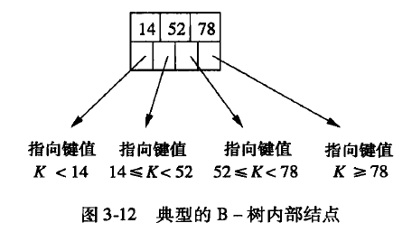
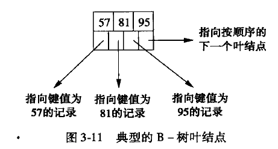
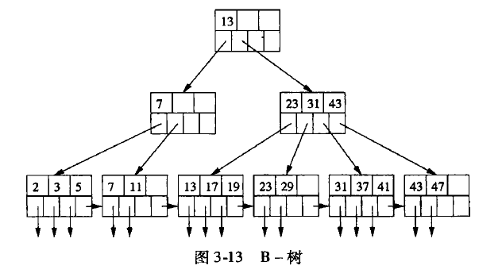

# 基础理论
## 形态
### 节点类型
- 内部节点

- 叶子节点

### 树

### 节点键值数n
每个节点包含的键值数目，是B-树的一个重要参数。
每个内部节点包含n个键值，以及n+1个指针，这些指针指向下一层内部节点，或者叶子节点的键值。
每个叶子节点，包含n个键值，以及n+1个指针。这些指针指向真正想存储的值。
上图中n = 3

## 查询 

## 插入

## 删除

## 应用
#### 应用1
每个叶节点为数据文件的每条记录，保存了一个key-pointer对。这里的key，可以是数据文件中数据记录中的任何一个字段值，pointer则指向该数据记录。因此，采用此种组织，数据文件中记录无须按key顺序排列，只要访问B-Tree，也能按key对数据文件进行排序。

**问题**：能否在同一棵B-树中保存多个key？

#### 应用2
每个叶节点为数据文件的每个块，保存了一个key-pointer对。这里的key，是数据块中的key，pointer则指向数据块。这种组织要求数据文件按key排序。

# postgresql的实现

# 总结
